# AI-Integrated SIEM System for Early File Abnormality Detection

A small SIEM project that scores endpoint file activity using a Random Forest model, IOC matching, and MITRE ATT&CK mapping, then routes the result through Shuffle SOAR based on severity.

There are two pipelines: one that trains the model offline, one that runs detection in realtime.



## Training

1. Labeled dataset (benign + malicious)
2. Feature extraction
3. Split into train / val / test, 60 / 20 / 20
4. Train a Random Forest model
5. Deploy the trained model into the detection pipeline

## Detection (realtime)

1. Elasticsearch holds endpoint logs
2. New logs pulled by timestamp
3. Feature extraction
4. Deployed model produces an ML score

## Multi-source risk scoring

Three signals get combined into one composite score, 0 to 100:

- Machine Learning score — weight 50%
- IOC match — weight 20%
- MITRE ATT&CK mapping — weight 30%

## Severity routing

- Safe, below 20 — discarded
- Low, 20 to 39 — alert sent
- Medium, 40 to 59 — alert sent
- High, 60 to 79 — case created
- Critical, 80 and above — auto block

Low, Medium, High, and Critical all forward to Shuffle SOAR. Safe is the only one that gets dropped.

## Setup

```bash
git clone https://github.com/Willem476/AI-integrated-SIEM-system-for-early-file-abnormally-detection.git
cd AI-integrated-SIEM-system-for-early-file-abnormally-detection
pip install -r requirements.txt
```

Dataset (Google Drive): https://drive.google.com/drive/folders/1lZFBC8XPqqc89aRZeWYO6PeQX7KYlubV?hl=vi

`AI_integration/` has two standalone scripts. Each one trains its own model from a local CSV and then runs realtime detection against Elasticsearch — there's no separate train step, training happens automatically on every run.

- `command_detection_local.py` — flags suspicious command lines, trains on `data2/command_line_AI_10pct_labeled.csv`
- `malware_detection_local.py` — flags suspicious files, trains on `data/AI Monitoring Logs.csv` and `data/synthetic_malware_30k_fixed.csv`

Download the dataset from the link above and lay it out like this before running anything:

```
data/
  AI Monitoring Logs.csv
  synthetic_malware_30k_fixed.csv
data2/
  command_line_AI_10pct_labeled.csv
  Windows_File_Activity_Dataset.csv
```

Both scripts have Elasticsearch host, API key, and the Shuffle webhook URL hardcoded near the top of the file (the `CONFIG` dict) — open the script and fill those in for your own environment before running it.

```bash
pip3 install pandas numpy scikit-learn scipy requests elasticsearch

python3 AI_integration/malware_detection_local.py --once
python3 AI_integration/command_detection_local.py --once
```

Drop `--once` to keep it polling. Both also take `--interval N` to change the poll rate, and `command_detection_local.py` has `--no-alert` / `--show-payload` for testing without hitting Shuffle.

## Status

Portfolio project. Not under active development.

Author: Nguyen
