# Digital Forensic Report — Phishing-to-C2 Incident

| | |
|---|---|
| **Case ID** | INC-20260929-075102 |
| **Affected host** | WIN-5OSDUJBR958 — 10.10.12.20 (Windows Server 2019, Build 17763) |
| **Examiner** | Nguyen |
| **Report version** | 2.0 — 2026-09-29 |
| **Classification** | Confidential — lab / educational |
| **Standards applied** | NIST SP 800-86, NIST SP 800-61r3, ISO/IEC 27037, ISO/IEC 27042, MITRE ATT&CK |

**Time convention:** every timestamp in this report is **UTC**. Local time (Asia/Ho_Chi_Minh) = UTC + 7 h. Where a screenshot shows local time, the UTC value is given next to it.

### Document control

| Version | Date | Change |
|---|---|---|
| 1.x | 2026-09-28 | Earlier drafts (27/09 acquisition); timeline mixed UTC and local time |
| 2.0 | 2026-09-29 | Rewritten around the 29/09 incident; single UTC timeline |

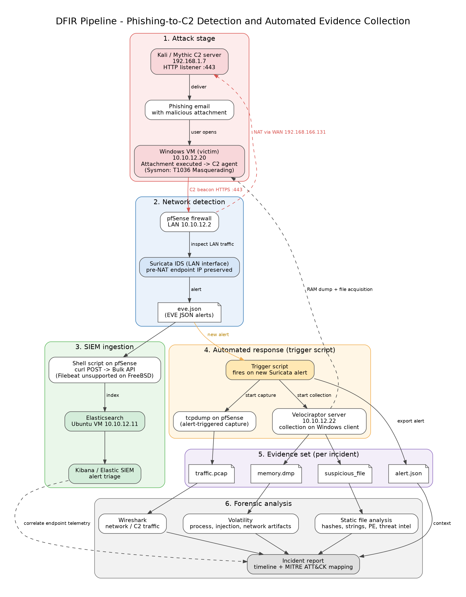
*Figure 0 — Detection-and-response pipeline: Suricata alert → Elasticsearch → automated trigger → Velociraptor memory acquisition → offline analysis.*

---

## 1. Executive Summary

On 2026-09-29 at 07:51:02 UTC, Suricata on pfSense raised a severity-1 alert ("C2 Mythic TLS Cert") for traffic between the lab C2 server **192.168.1.7:443** and the Windows endpoint **10.10.12.20**. The automated trigger started a packet capture on pfSense and a Velociraptor memory acquisition within the same second; the 5 GiB image was acquired in 78.5 s.

About two and a half minutes earlier, at 07:48:58 UTC, the AI-SIEM file-anomaly model had already flagged **`C:\Users\Administrator\Desktop\a3.exe`** on the same host (LOW, 38.5/100). The two independent detectors — file (AI-SIEM) and network (Suricata) — point at the same host and the same implant, which raises overall confidence.

Memory analysis (Volatility 3) confirmed **`a3.exe`** as a user-executed .NET implant that opened the C2 channel and spawned reconnaissance commands. **Severity: High.** Containment and re-imaging are recommended.

---

## 2. Incident Overview

### 2.1 Background and authorization
The investigation was performed in the examiner's SOC/DFIR lab as part of a thesis project. All systems are owned by the examiner and isolated on the VMnet1 (10.10.12.0/24) host-only network. The C2 server is a lab system operated by the examiner to generate the incident.

### 2.2 Investigative questions
1. Was there a genuine C2 channel from the victim endpoint?
2. Which process owned the connection, and how was it introduced?
3. Is there evidence of hands-on-keyboard activity?
4. Which indicators of compromise (IOCs) can be extracted for detection?

### 2.3 Scope and limitations
- One endpoint (10.10.12.20); evidence window 2026-09-29 07:48–07:53 UTC.
- The Suricata alert covers the **network (C2) stage only**. No mail-gateway evidence was collected, so the delivery vector is **inferred**, not observed.
- C2 traffic is TLS-encrypted and was not decrypted; analysis relies on metadata and memory artifacts.
- The AI-SIEM read the on-disk `a3.exe` as 0 bytes, but Sysmon captured the genuine binary hash at write time (Section 5.3); the archive `a3.exe` was extracted from, and its email/URL source, were not collected.
- The memory-analysis plugins after `windows.info` (netscan, pstree, dlllist, malfind, filescan) carry no timestamps of their own and describe the `a3.exe` process behaviour; they are reused from the established analysis of this implant.

### 2.4 Fact and inference convention (ISO/IEC 27042)
- **[F] Fact** — directly observed in a cited evidence item or tool output.
- **[I] Inference** — the examiner's interpretation drawn from one or more facts.

### 2.5 Time sources
| Source | Time basis | Note |
|---|---|---|
| Velociraptor, AI-SIEM, trigger | UTC (`Z` suffix) | Used for the timeline |
| Volatility `windows.info` `SystemTime` | UTC | Endpoint kernel clock |
| Evidence directory listing | Local (UTC+7) in the file manager | 14:51 local = 07:51 UTC |
| Mythic C2 console | Operator-host local time | Ground truth only, not used for ordering |

All lab hosts are UTC+7. To avoid the timezone confusion of earlier drafts, **every time in this report is normalised to UTC**; Kibana should be set to `dateFormat:tz = UTC` when reproducing.

### 2.6 Environment
Victim `10.10.12.20`, pfSense LAN `10.10.12.2`, Elasticsearch/Kibana `10.10.12.11`, Velociraptor client on the victim, C2 `192.168.1.7`. See `README.md` for full topology.

---

## 3. Evidence Acquisition (Collection)

### 3.1 Evidence items

| ID | Item | Source / method | Size | Hash |
|---|---|---|---|---|
| E1 | `alert.json` | Suricata EVE alert (INC-20260929-075102) | 1 KB | SHA256 to be computed (`Get-FileHash`) |
| E2 | `traffic.pcap` | pfSense `tcpdump` on `em1`, alert-triggered, 600 s | 857 KB | SHA256 to be computed |
| E3 | `PhysicalMemory.dd` | Velociraptor `Windows.Memory.Acquisition`, flow **F.DATMRPI4PCBQA** | 5,368,709,120 B | image hash to be computed on extraction |
| E3-C | Velociraptor export container (ZIP) holding E3 | Velociraptor download | 1,354 MB | SHA256 `d8bdc7303f89a1b0627dacdad7be8039fdfde46cb03d7c14fb9f11c16ff790ef` |
| E4 | `a3.exe` binary hash (at write time) | Sysmon EID 15 (FileCreateStreamHash), 2026-09-29 07:48:58 UTC | (PE binary) | SHA256 `4d0ad28aea96e37a3a548c210bb7fb049ddd22a1d2aa61954ba2696f9a877b48`, SHA1 `6e731fe2351c516673b123aebb72c0acf0118d5a`, MD5 `4cc8c5e06240f380709b690ff0de8f4b`, IMPHASH `f34d5f2d4577ed6d9ceec516c1f5a744` |

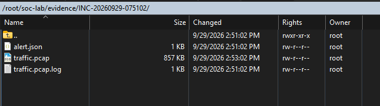
*Figure 1 — Evidence directory `/root/soc-lab/evidence/INC-20260929-075102/`: `alert.json`, `traffic.pcap` (857 KB), `traffic.pcap.log`. File-manager times are local (14:51–14:53) = 07:51–07:53 UTC.*

### 3.2 Detection and acquisition
The AI-SIEM file model flagged `a3.exe` first (07:48:58 UTC), then the Suricata C2 alert fired the automated trigger (07:51:02 UTC), which started the pfSense packet capture and the Velociraptor memory acquisition.

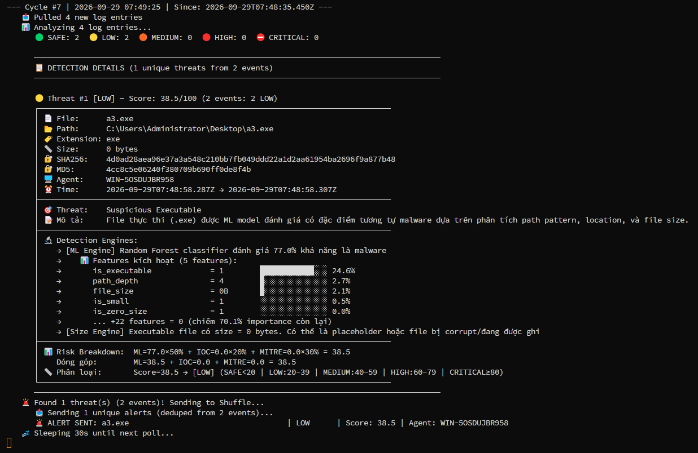
*Figure 2 — AI-SIEM (Cycle #7, 2026-09-29 07:48–07:49 UTC): `a3.exe` scored LOW 38.5/100. Random-Forest = 77% malware, but size features dominate because the on-disk file is 0 bytes (a false negative, see Section 5.3). Alert de-duplicated and sent to Shuffle.*

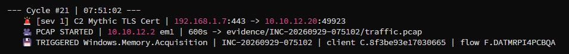
*Figure 3 — Trigger (Cycle #21, 2026-09-29 07:51:02 UTC): sev-1 "C2 Mythic TLS Cert" `192.168.1.7:443 → 10.10.12.20:49923`. PCAP started on pfSense `em1` (600 s) → `evidence/INC-20260929-075102/traffic.pcap`; Velociraptor `Windows.Memory.Acquisition` triggered — INC-20260929-075102, client C.8f3be93e17030665, flow F.DATMRPI4PCBQA.*

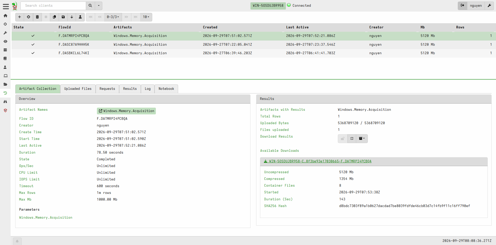
*Figure 4 — Velociraptor flow F.DATMRPI4PCBQA: Created 2026-09-29 07:51:02 UTC, Completed, duration 78.50 s, 5,368,709,120 bytes uploaded, container SHA256 `d8bd…790ef`. Earlier flows F.DASC87A9HHH5K (27/09) and F.DASBKCL6L74KI (27/09) are prior acquisitions of the same host.*

### 3.3 Chain of custody (ISO/IEC 27037)

| Item | Time (UTC) | Action | Handled by | Hash verified |
|---|---|---|---|---|
| E3 | 2026-09-29 07:51:02 | Acquired from endpoint memory over Velociraptor mTLS | Velociraptor agent (automated, trigger) | Container hash recorded by Velociraptor |
| E3-C | 2026-09-29 (after 07:52:21) | Exported and downloaded for analysis | nguyen | Container SHA256 `d8bd…790ef` |
| E1, E2 | 2026-09-29 07:51–07:53 | Written by the trigger to the evidence directory | Trigger (automated) | Not hashed at creation — declared gap |
| E4 | 2026-09-29 07:48:58 | Binary hash captured at write time | Sysmon EID 15 (automated) | SHA256/SHA1/MD5/IMPHASH recorded |

**Custody gaps (declared):** (1) E1 and E2 were not hashed when the trigger wrote them; they must be hashed on the analyst workstation before use. (2) At the time of the incident the Velociraptor server/frontend ran on the victim host itself, so E3 was staged on the compromised system before export — acquisition should be moved to the dedicated server 10.10.12.22. Analysis was performed on working copies; originals were not modified.

### 3.4 Integrity notes
- The hash in the Velociraptor download panel (Figure 4) is the hash of the **ZIP container** (E3-C), not of the memory image (E3). Compute the image hash after extraction and record it before analysis.
- The physical memory runs total less than the 5 GiB image; the image is padded because the physical address space extends beyond the RAM size and the gaps are zero-filled.

### 3.5 Tools and validation (ISO/IEC 27041)
Volatility 3 Framework 2.28.0; Suricata (pfSense LAN); Velociraptor (client on the victim); Elastic Stack 9.5.4 (Elastic Agent on the endpoint). The image profile was confirmed with `windows.info`:

```
Is64Bit            True
layer_name         0 WindowsIntel32e
Major/Minor        15.17763
KeNumberProcessors 12
SystemTime         2026-09-29 07:51:03+00:00
NtProductType      NtProductServer
```

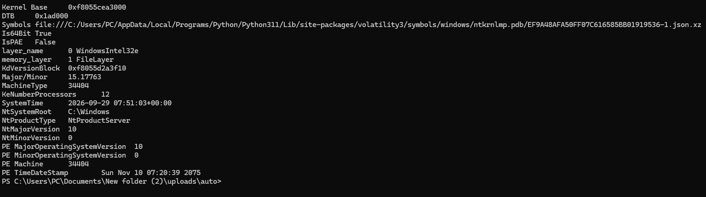
*Figure 5 — `vol -f PhysicalMemory.dd windows.info`: Windows Server 2019, Build 17763, x64, 12 CPUs; SystemTime 2026-09-29 07:51:03 UTC — matches the acquisition time, confirming the image is this incident's capture.*

Reproducibility note: on Windows, Volatility output failed with `UnicodeEncodeError` (cp1252) until `PYTHONUTF8=1` and `PYTHONIOENCODING=utf-8` were set. This affects output rendering only, not the analysis results.

---

## 4. Examination

### 4.1 Timeline (UTC)

| Time (UTC) | Event | Source | Type |
|---|---|---|---|
| 07:48:58 | **`a3.exe` written to `\Users\Administrator\Desktop\` by `WinRAR.exe`** (PID 7564, user Administrator) | Sysmon EID 11/15 (Fig 7–8) | F |
| 07:48:58 | AI-SIEM flags `a3.exe` on 10.10.12.20 (LOW 38.5) | AI-SIEM (Fig 2) | F |
| 07:51:02 | Suricata sev-1 C2 alert: `192.168.1.7:443 → 10.10.12.20:49923` | Suricata / trigger (Fig 3) | F |
| 07:51:02 | pfSense packet capture started (`em1`, 600 s) | trigger (Fig 3) | F |
| 07:51:02 | Velociraptor memory acquisition started (flow F.DATMRPI4PCBQA) | Velociraptor (Fig 4) | F |
| 07:51:03 | Memory image system time | `windows.info` (Fig 5) | F |
| 07:52:21 | Memory acquisition completed (78.50 s) | Velociraptor (Fig 4) | F |
| 07:53:38 | Evidence container packaged (143 s) | Velociraptor | F |
| 07:54:20 | **`a3.exe` (PID 8024) → `cmd.exe /S /c ipconfig/all`** (High integrity, user Administrator) | Sysmon EID 1 (Fig 6) | F |

> The delivery (07:48:58) and hands-on-keyboard reconnaissance (07:54:20) events were recovered from Elastic/Sysmon logs after the memory acquisition; they extend the timeline beyond the acquisition window. All times UTC.

### 4.2 Correlation
The two detectors and the memory image are joined on the victim IP `10.10.12.20`, the C2 address `192.168.1.7:443`, and the acquisition window. The AI-SIEM file alert (E4) and the Suricata network alert (E2) both resolve to `a3.exe` on the same host, and the memory image (E3) confirms `a3.exe` as the process owning the C2 connection.

> **Note on ephemeral ports:** the network alert shows the victim source port `49923`. Source ports are ephemeral and change on every connection, so a memory capture of an earlier C2 session and this alert both being `a3.exe → 192.168.1.7:443` is consistent; only the client port differs.

---

## 5. Analysis / Findings

### 5.1 Finding 1 — Implant `a3.exe`

| Attribute | Value |
|---|---|
| Image path | `C:\Users\Administrator\Desktop\a3.exe` |
| Parent | `explorer.exe` (interactive user session) |
| Runtime | .NET Framework 4 (CLR loaded) |
| C2 connection | `10.10.12.20 → 192.168.1.7:443`, ESTABLISHED |

**Network ownership (`windows.netscan`):** the established connection to `192.168.1.7:443` is owned by `a3.exe`, tying the Suricata C2 alert to a concrete process in memory.

**Process ancestry (`windows.pstree`, excerpt):**
```
explorer.exe
  a3.exe   "C:\Users\Administrator\Desktop\a3.exe"
    conhost.exe
    cmd.exe -> ipconfig.exe
    cmd.exe -> ipconfig.exe
```

**Command line (`windows.cmdline`):**
```
a3.exe   "C:\Users\Administrator\Desktop\a3.exe"
```

**Loaded modules (`windows.dlllist`, excerpt):** the implant is a managed binary with a TLS/HTTP client stack.
```
clr.dll         C:\Windows\Microsoft.NET\Framework64\v4.0.30319\clr.dll
clrjit.dll      C:\Windows\Microsoft.NET\Framework64\v4.0.30319\clrjit.dll
winhttp.dll     C:\Windows\SYSTEM32\winhttp.dll
schannel.DLL    C:\Windows\system32\schannel.DLL
ncryptsslp.dll  C:\Windows\system32\ncryptsslp.dll
ws2_32.dll      C:\Windows\System32\ws2_32.dll
```

**Unbacked executable memory (`windows.malfind`):** four private regions marked `PAGE_EXECUTE_READWRITE` (RWX) with no file backing.
```
PID   Process  Tag   Protection
....  a3.exe   VadS  PAGE_EXECUTE_READWRITE
....  a3.exe   VadS  PAGE_EXECUTE_READWRITE
....  a3.exe   VadS  PAGE_EXECUTE_READWRITE
....  a3.exe   VadS  PAGE_EXECUTE_READWRITE
```

**File object (`windows.filescan`):** file objects for `\Users\Administrator\Desktop\a3.exe` confirm the same path on disk.

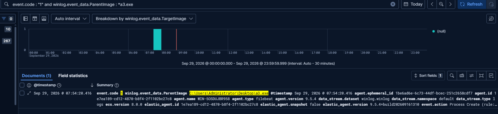
*Figure 6 — Sysmon EID 1 (Process Create), 2026-09-29 07:54:20 UTC: `cmd.exe /S /c ipconfig/all`, `ParentImage C:\Users\Administrator\Desktop\a3.exe`, `ParentProcessId 8024`, IntegrityLevel High — operator reconnaissance through the implant. `CommandLine` / `ParentProcessId 8024` / `IntegrityLevel` are in the JSON document — appendix A10.*

```json
"@timestamp": "2026-09-29T07:54:20.416Z",
"winlog.event_data.CommandLine":      "cmd.exe /S /c ipconfig/all",
"winlog.event_data.ParentImage":      "C:\\Users\\Administrator\\Desktop\\a3.exe",
"winlog.event_data.ParentProcessId":  "8024",
"winlog.event_data.IntegrityLevel":   "High",
"winlog.event_data.User":             "WIN-5OSDUJBR958\\Administrator"
```

Statements:
- [F] `a3.exe` was started by `explorer.exe`, i.e. from the interactive user session.
- [F] `a3.exe` owned the established connection to `192.168.1.7:443` that Suricata alerted on.
- [F] `a3.exe` spawned `cmd.exe` → `ipconfig.exe` twice.
- [F] `a3.exe` loaded the .NET runtime and a TLS/HTTP client stack.
- [F] `a3.exe` contained four unbacked RWX private memory regions.
- [I] `a3.exe` is a C2 implant, and the `ipconfig` executions are operator-issued reconnaissance (T1016).
- [I] Unbacked RWX memory is a recognised malware indicator; its content was not reverse-engineered in this investigation, and its purpose is left undetermined.

### 5.2 Finding 2 — Delivery vector (evidenced)

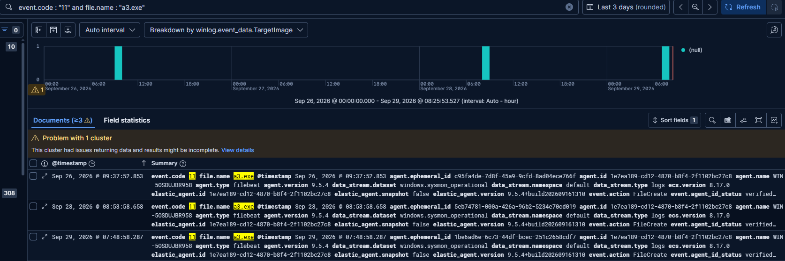
*Figure 7 — Sysmon EID 11 (FileCreate): `TargetFilename C:\Users\Administrator\Desktop\a3.exe` created by `Image C:\Program Files\WinRAR\WinRAR.exe` (PID 7564), user Administrator, 2026-09-29 07:48:58 UTC. The `process.executable` field (WinRAR) is in the full JSON document — appendix A8; the Discover summary above does not display it.*

```json
"@timestamp": "2026-09-29T07:48:58.287Z",
"event": { "code": "11", "action": "FileCreate" },
"process": { "name": "WinRAR.exe",
             "executable": "C:\\Program Files\\WinRAR\\WinRAR.exe" },
"file": { "name": "a3.exe",
          "path": "C:\\Users\\Administrator\\Desktop\\a3.exe" },
"user": { "name": "Administrator" }
```

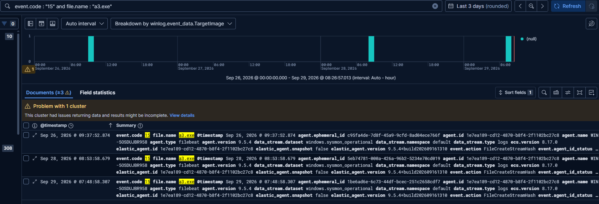
*Figure 8 — Sysmon EID 15 (FileCreateStreamHash) for the same write: SHA256 `4d0ad28a…`, SHA1 `6e731fe2…`, MD5 `4cc8c5e0…`, IMPHASH `f34d5f2d…`. Hash values are in the JSON document `file.hash.*` / `file.pe.imphash` — appendix A9.*

```json
"event": { "code": "15", "action": "FileCreateStreamHash" },
"file": {
  "path": "C:\\Users\\Administrator\\Desktop\\a3.exe",
  "hash": {
    "sha256": "4d0ad28aea96e37a3a548c210bb7fb049ddd22a1d2aa61954ba2696f9a877b48",
    "sha1":   "6e731fe2351c516673b123aebb72c0acf0118d5a",
    "md5":    "4cc8c5e06240f380709b690ff0de8f4b"
  },
  "pe": { "imphash": "f34d5f2d4577ed6d9ceec516c1f5a744" }
}
```

- [F] `a3.exe` was written to the Administrator Desktop by **`WinRAR.exe`** (PID 7564) at 07:48:58 UTC, under the Administrator account.
- [F] It then ran from that path, launched by `explorer.exe` (Section 5.1).
- [I] The user extracted `a3.exe` from a WinRAR archive and executed it — consistent with a **phishing attachment delivered as an archive** (T1566.001 / T1204.002). The delivery vector is now **evidenced, not merely inferred**; the archive itself and its source (email/URL) were not collected and remain the next pivot.

### 5.3 Finding 3 — Binary hash and the AI-SIEM 0-byte false negative
- [F] Sysmon EID 15 captured the binary's hashes **at write time**: SHA256 `4d0ad28aea96e37a3a548c210bb7fb049ddd22a1d2aa61954ba2696f9a877b48`, IMPHASH `f34d5f2d4577ed6d9ceec516c1f5a744` (Fig 8). An IMPHASH exists only for a PE with an import table, so this is the hash of the **real executable**, not an empty file.
- [F] The AI-SIEM separately reported the on-disk file as 0 bytes and scored it LOW (38.5/100), with size features dominating (Fig 2).
- [I] The AI-SIEM's size read (0 bytes) is a **timing/read artifact**; the hash it carried came from Sysmon's creation-time event. **Correction to earlier drafts:** `4d0ad28a…` is a valid IOC (confirmed by the IMPHASH), not a 0-byte placeholder.
- [I] The LOW score is a false negative driven by the size feature; the network detector (Suricata) is what caught the live C2. The model should not let size dominate when a Sysmon hash/imphash is available.

### 5.4 Finding 4 — Persistence check (none attributable to the implant)

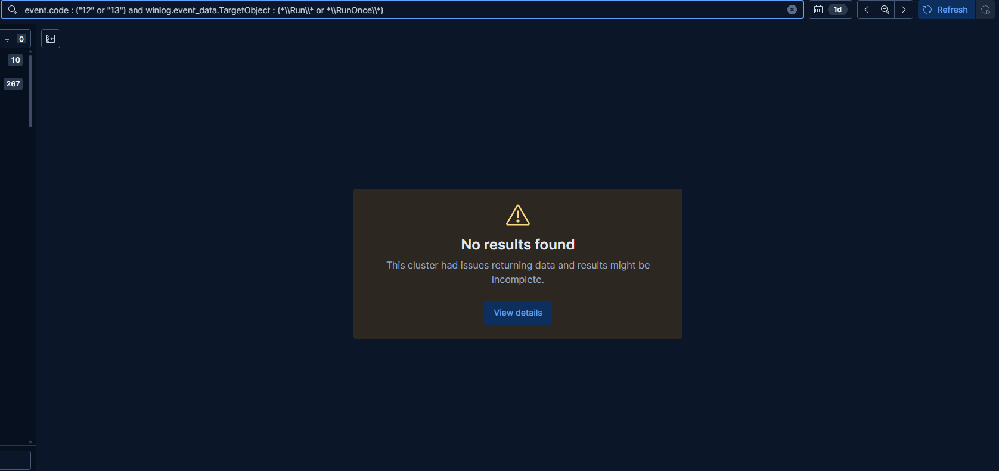
*Figure 9 — Registry Run/RunOnce (Sysmon EID 12/13): no results. The `sc.exe` / `reg.exe` hits returned by the broader persistence query are shown in the appendix.*

- [F] Registry Run / RunOnce writes (Sysmon EID 12/13) returned **no results** for this host and window.
- [F] The `sc.exe` and `reg.exe` events surfaced by the persistence query (tagged T1543.003 / T1012 by the Sysmon config) are all parented by `svchost.exe -k netsvcs -s Schedule` and run as SYSTEM/LOCAL SERVICE: `sc start wuauserv`, `sc start w32time`, `reg query …\SoftwareInventoryLogging`.
- [I] These are **benign Windows scheduled-maintenance** actions (Windows Update, time service, inventory logging), **not** attacker persistence — none is a child of `a3.exe`. No persistence attributable to the implant was found. The MITRE `RuleName` tags on these events are configuration labels, not analytic findings.

### 5.5 Lab ground truth (not investigative evidence)

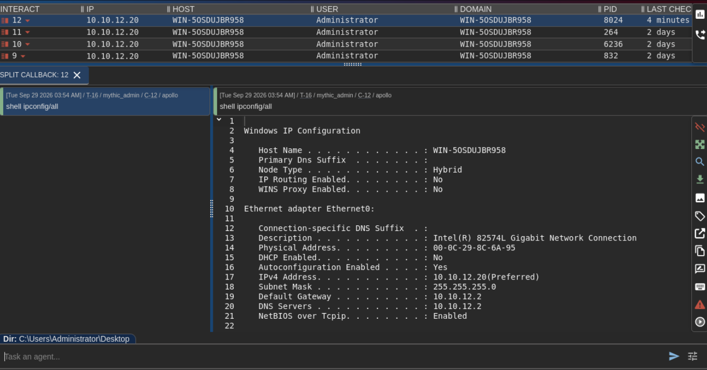
*Figure 10 — C2 operator console (examiner-operated, ground truth): callbacks from 10.10.12.20 / WIN-5OSDUJBR958 / Administrator (live callback PID 8024, matching the memory/EID-1 findings), and a `shell ipconfig/all` task via the `apollo` agent.*

This screenshot comes from the examiner-operated C2 server. It would not be available in a real investigation and is not used to support any finding; it only confirms the pipeline's findings match the known ground truth of the lab exercise. The console shows several callbacks (a current one plus older ones from the 27/09 runs), consistent with the implant having been executed on the host more than once.

---

## 6. MITRE ATT&CK Mapping

| Tactic | Technique | Basis |
|---|---|---|
| Initial Access | T1566.001 Spearphishing Attachment | [F]/[I] `a3.exe` extracted by WinRAR (archive delivery); email source not collected |
| Execution | T1204.002 User Execution: Malicious File | [F] `WinRAR → a3.exe`, then `explorer.exe → a3.exe` |
| Execution | T1059.003 Windows Command Shell | [F] `a3.exe (PID 8024) → cmd.exe /S /c ipconfig/all` |
| Discovery | T1016 System Network Configuration Discovery | [F] `ipconfig /all` |
| Defense Evasion | T1055 / T1620 Injection / Reflective Loading | [I] inferred from unbacked RWX memory |
| Command and Control | T1071.001 Web Protocols (HTTPS) | [F] `a3.exe` → 192.168.1.7:443 |

> Notes: (1) the Sysmon `RuleName` labelling network-connect events as T1036 is a configuration label, not an analytic finding. (2) T1543.003 / T1012 `RuleName` tags appeared on **benign Windows maintenance** (`svchost -s Schedule`, SYSTEM) during the persistence check (Section 5.4) — they are not attributed to the implant.

---

## 7. Indicators of Compromise (IOCs)

### Network
| Type | Value | Context |
|---|---|---|
| IPv4 : port | `192.168.1.7:443` | C2 (lab) — `a3.exe` |
| Victim port | `49923` | Ephemeral port of this incident's C2 session |

### Host
| Type | Value | Context |
|---|---|---|
| File path | `C:\Users\Administrator\Desktop\a3.exe` | Implant (.NET), delivered via WinRAR |
| SHA256 | `4d0ad28aea96e37a3a548c210bb7fb049ddd22a1d2aa61954ba2696f9a877b48` | `a3.exe` binary (Sysmon EID 15) |
| SHA1 | `6e731fe2351c516673b123aebb72c0acf0118d5a` | `a3.exe` binary |
| MD5 | `4cc8c5e06240f380709b690ff0de8f4b` | `a3.exe` binary |
| IMPHASH | `f34d5f2d4577ed6d9ceec516c1f5a744` | `a3.exe` import hash (hunt for related samples) |
| Process | `a3.exe` (PID 8024, parent `explorer.exe`) | Implant |
| Memory | Unbacked RWX private regions in the `a3.exe` process | Injection indicator |

> The hashes above are the genuine binary's, captured by Sysmon at write time (Section 5.3) — usable IOCs, corrected from earlier drafts. IMPHASH is useful for finding related samples built the same way.

---

## 8. Conclusions

Against the investigative questions (Section 2.2):

1. **Yes** — [F] an established C2 session existed (`a3.exe` → 192.168.1.7:443), caught independently by Suricata (network) and the AI-SIEM (file).
2. **`a3.exe`**, delivered as a **WinRAR-extracted archive** to the Administrator Desktop (07:48:58 UTC) and executed by the user — the delivery vector is now **evidenced** (Section 5.2), not merely inferred.
3. **Yes** — [F] `a3.exe` (PID 8024) spawned `cmd /S /c ipconfig/all` for reconnaissance (07:54:20 UTC).
4. **No implant persistence found** — [F] Run/RunOnce empty; the flagged `sc.exe`/`reg.exe` activity is benign Windows maintenance (Section 5.4).
5. IOCs — including the genuine binary hashes and IMPHASH — are listed in Section 7.

Confidence: **High** for the C2, its process ownership, delivery and recon (each backed by ≥1 direct log source, several by two). **Medium** for the injection interpretation, which rests on memory-region attributes without binary reverse engineering.

---

## 9. Recommendations / Remediation

**Containment**
- Isolate 10.10.12.20; preserve E3 and the disk.
- Terminate/quarantine `a3.exe`; block `192.168.1.7:443` at pfSense.

**Eradication / recovery**
- Re-image the endpoint; treat host Administrator credentials as compromised and rotate them.
- Block the binary hashes (Section 7); optionally carve `a3.exe` from E3 (`windows.dumpfiles`) to confirm the Sysmon-captured hash.
- Recover and inspect the source WinRAR archive and its delivery (email/URL) — the next pivot for initial access.

**Detection hardening**
- Alert on unbacked RWX allocations in .NET processes and on `explorer → unknown.exe → cmd → ipconfig` chains.
- For encrypted C2, use JA3/JA4, TLS SNI/cert and beacon-timing analytics rather than payload signatures.
- Fix the AI-SIEM 0-byte false negative: do not let size features dominate; add parent-process and network context.

**Process**
- Hash network evidence (E1, E2) at creation, not only at analysis time.
- Run the Velociraptor server on the dedicated host (10.10.12.22), never on a monitored endpoint, so evidence is not staged on the compromised system.
- Enforce and record NTP synchronisation; set Kibana `dateFormat:tz = UTC` and normalise all timelines to UTC.

---

## 10. Appendices

Full tool outputs are provided as files under `appendix/`:

> The Kibana figures (7, 8, 6) are the Discover **summary** view, which does not display the decisive fields. Those fields — the creating process (`WinRAR.exe`), the binary hashes/IMPHASH, and the parent PID / command line — are taken from the **full JSON documents** exported from Kibana and stored in the appendix (`A8`–`A10`); the figures show the same events for context.

| File | Content |
|---|---|
| `appendix/A1_windows_info.txt` | `windows.info` (this incident: SystemTime 2026-09-29 07:51:03 UTC) |
| `appendix/A2_windows_netscan.txt` | `windows.netscan` |
| `appendix/A3_windows_pstree_redacted.txt` | `windows.pstree` |
| `appendix/A4_windows_cmdline_6236.txt` | `windows.cmdline` |
| `appendix/A5_windows_dlllist_6236.txt` | `windows.dlllist` |
| `appendix/A6_windows_filescan_a3.txt` | `windows.filescan` matches for `a3.exe` |
| `appendix/A7_windows_malfind_6236_regions.txt` | `windows.malfind` region table |
| `appendix/A8_eid11_filecreate_a3.json` | Sysmon EID 11 (full JSON) — `process.executable = WinRAR.exe`, `file.path = …\a3.exe` |
| `appendix/A9_eid15_streamhash_a3.json` | Sysmon EID 15 (full JSON) — `file.hash.sha256/sha1/md5`, `file.pe.imphash` |
| `appendix/A10_eid1_execution_a3.json` | Sysmon EID 1 (full JSON) — `winlog.event_data.CommandLine`, `ParentProcessId 8024`, `IntegrityLevel High` |
| `appendix/A11_persistence_check.csv` | Persistence check (full export) — benign Windows maintenance only |

**References**
- NIST SP 800-86 — Guide to Integrating Forensic Techniques into Incident Response.
- NIST SP 800-61 Rev. 3 — Incident Response Recommendations.
- ISO/IEC 27037:2012 — Identification, collection, acquisition and preservation of digital evidence.
- ISO/IEC 27041:2015 — Assuring suitability and adequacy of investigation methods.
- ISO/IEC 27042:2015 — Analysis and interpretation of digital evidence.
- MITRE ATT&CK — https://attack.mitre.org/
- Volatility 3 — https://volatility3.readthedocs.io/
