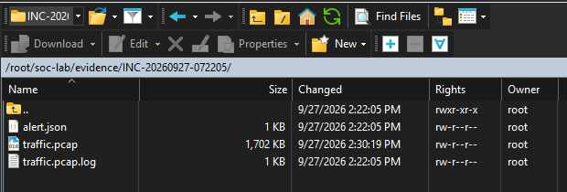
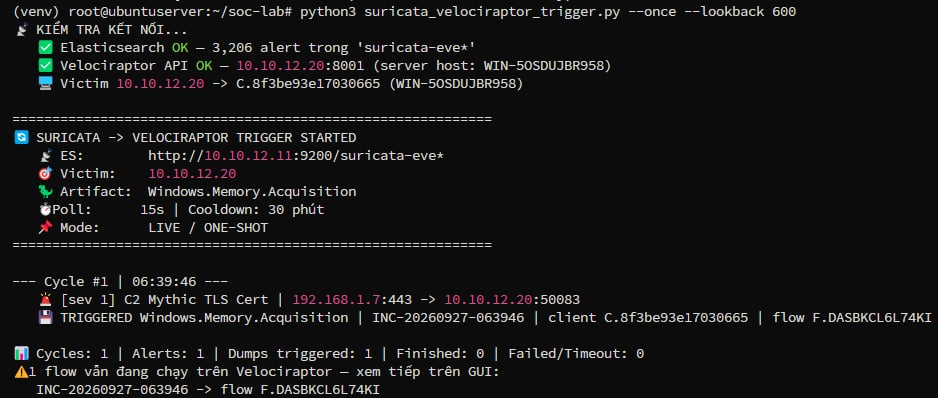
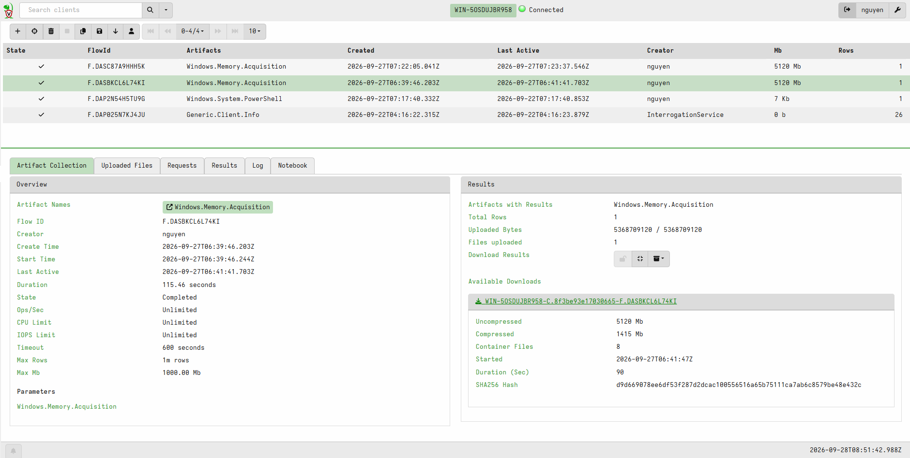
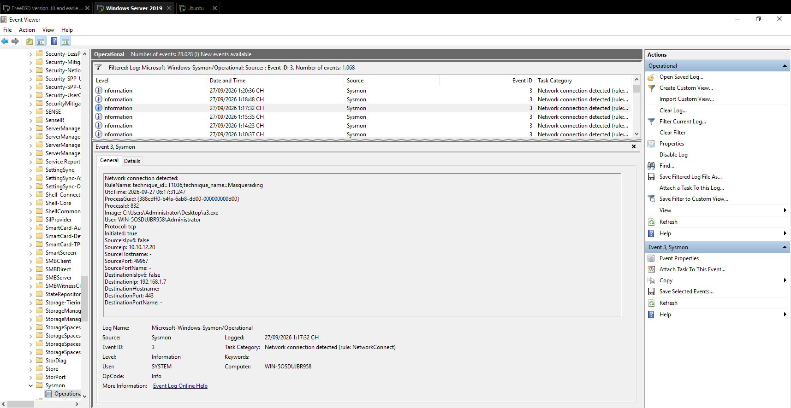
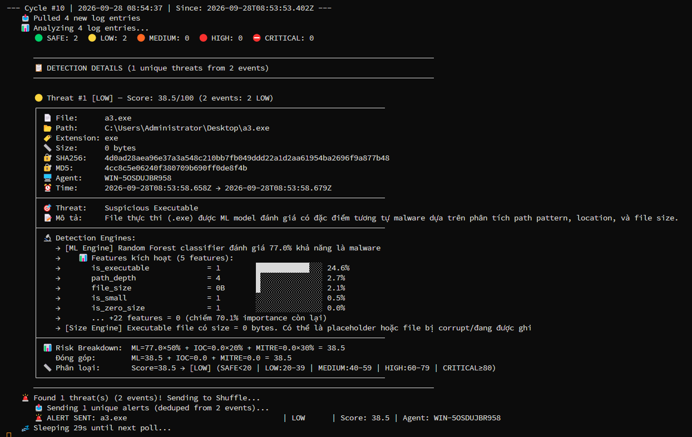
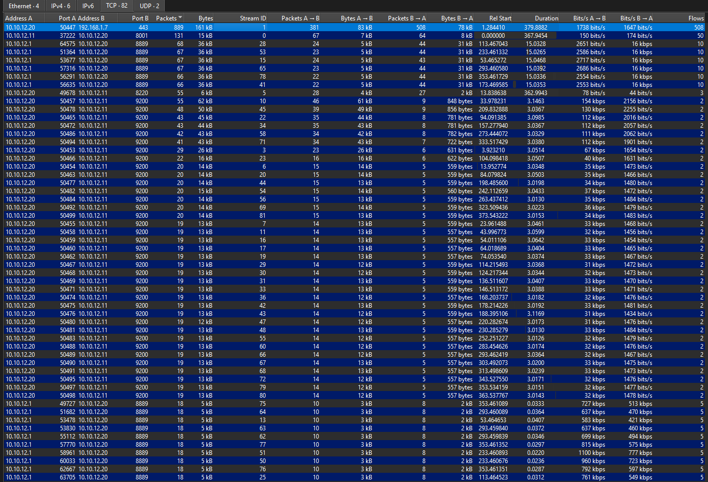
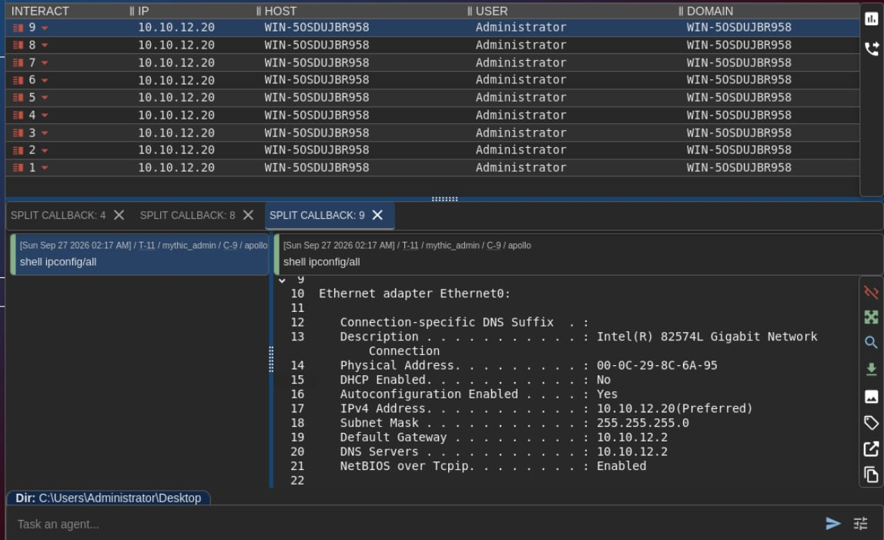

# Digital Forensic Report — Phishing-to-C2 Incident

| | |
|---|---|
| **Case ID** | INC-20260927-063946 (memory), INC-20260927-072205 (network) |
| **Affected host** | WIN-5OSDUJBR958 — 10.10.12.20 (Windows Server 2019, Build 17763) |
| **Examiner** | Nguyen (nguyen) |
| **Report version** | 1.1 — 2026-09-28 |
| **Classification** | Confidential — lab / educational |
| **Standards applied** | NIST SP 800-86, NIST SP 800-61r3, ISO/IEC 27037, ISO/IEC 27041, ISO/IEC 27042, MITRE ATT&CK |

### Document control

| Version | Date | Author | Change |
|---|---|---|---|
| 1.0 | 2026-09-28 | Nguyen | Initial report |
| 1.1 | 2026-09-28 | Nguyen | Added chain of custody, network-evidence hashes, fact/inference labelling, time-source statement, tool validation, appendix outputs |

| Review | Name | Date | Status |
|---|---|---|---|
| Technical review | *(pending)* | | |


*Figure 0 — Detection-and-response pipeline: Suricata alert → Elasticsearch → automated trigger → Velociraptor memory acquisition → offline analysis.*

---

## 1. Executive Summary

On 2026-09-27, the automated detection pipeline flagged command-and-control (C2) traffic from the Windows endpoint **10.10.12.20** to **192.168.1.7:443**. The Suricata alert triggered automated memory acquisition through Velociraptor, and the evidence was analyzed offline with Volatility 3.

Analysis established that a **.NET executable, `a3.exe`**, launched by the interactive user from the Administrator Desktop (PID 6236), held an established session to the C2 server and spawned reconnaissance commands (`ipconfig`). Sysmon independently recorded the same binary's connection to the C2 server; the installed Sysmon configuration labelled that event with RuleName **T1036 (Masquerading)**.

A **second, independent remote-access channel** was also found: a **ScreenConnect client installed under a deceptive path** (`C:\Program Files (x86)\Microsoft Visual C++ 2015\`), connected to the external host **support.open-port-vpn.top (191.101.45.59):8041** since system boot.

**Severity: High.** Two concurrent remote-control channels, interactive operator activity and unbacked executable memory in the implant. Containment and re-imaging are recommended.

---

## 2. Incident Overview

### 2.1 Background and authorization
The investigation was performed in the examiner's SOC/DFIR lab as part of a thesis project. All systems are owned by the examiner and isolated on the VMnet1 (10.10.12.0/24) host-only network. The C2 server is a lab system operated by the examiner to generate the incident.

### 2.2 Investigative questions
1. Was there a genuine C2 channel from the victim endpoint?
2. Which process owned the connection, and how was it introduced?
3. Is there evidence of hands-on-keyboard activity?
4. Are there additional access channels or persistence mechanisms?
5. Which indicators of compromise (IOCs) can be extracted for detection?

### 2.3 Scope and limitations
- One endpoint (10.10.12.20); evidence window 2026-09-27 05:59–07:22 UTC.
- The Suricata alert covers the **network (C2) stage only**. No email or mail-gateway evidence was collected, so the delivery vector is **inferred**, not observed.
- C2 traffic is TLS-encrypted and was not decrypted; analysis relies on metadata and memory artifacts.
- The on-disk `a3.exe` was later observed as a **0-byte file** (Section 5.4); no valid on-disk hash of the live binary exists.
- The network evidence (INC-20260927-072205) and the memory image (INC-20260927-063946) come from **two different C2 sessions** (Section 4.3).
- Clock synchronisation (NTP) across lab hosts was **not verified**; see Section 2.5.
- At the time of the incident the **Velociraptor server (frontend) ran on the victim host itself** (10.10.12.20, PID 6944, ports 8000/8001/8889), not on the dedicated server 10.10.12.22. The acquired image was therefore staged on the compromised host before export. This is a custody weakness (Section 3.3) and the Velociraptor processes appear in the memory image.

### 2.4 Fact and inference convention (ISO/IEC 27042)
Statements in Section 5 are labelled:
- **[F] Fact** — directly observed in a cited evidence item or tool output.
- **[I] Inference** — the examiner's interpretation drawn from one or more facts.

### 2.5 Time sources
| Source | Time basis in evidence | Notes |
|---|---|---|
| Memory image (`windows.info`, netscan, pstree) | UTC | Endpoint kernel clock |
| Sysmon | `UtcTime` field (UTC); Event Viewer display in local time | 06:17:31 UTC = 13:17 local |
| Velociraptor | UTC (`Z` suffix) | Server clock |
| Trigger script / evidence directory | Server local time, converted to UTC | 14:22:05 local = 07:22:05 UTC |
| Mythic C2 UI | Operator-host local time | Not used for timeline ordering |

All hosts are in UTC+07:00. NTP synchronisation between hosts was not verified; timestamps from different hosts are ordered with an assumed tolerance of a few seconds. Where ordering depends on sub-minute differences across hosts, conclusions are stated as inferences.

### 2.6 Environment
Victim `10.10.12.20`, pfSense LAN `10.10.12.2`, Elasticsearch/Kibana `10.10.12.11`, Velociraptor `10.10.12.22`, C2 `192.168.1.7`. See `README.md` for full topology.

---

## 3. Evidence Acquisition (Collection)

### 3.1 Evidence items

| ID | Item | Source / method | Size | SHA256 |
|---|---|---|---|---|
| E1 | `alert.json` | Suricata EVE alert exported by trigger (INC-20260927-072205) | 1 KB | `bd49e274d8da4133a1ef73a7448079fdeb88c098a155b280d2a9918cbbcf7e89` |
| E2 | `traffic.pcap` | pfSense `tcpdump`, alert-triggered (INC-20260927-072205) | 1,702 KB | `7fa29ac565e48308d4059391b0d4f46de552b6ff4971de41bdd93618e4b90879` |
| E3 | `PhysicalMemory.dd` | Velociraptor `Windows.Memory.Acquisition`, flow F.DASBKCL6L74KI (INC-20260927-063946) | 5,368,709,120 B | `efa461225a760f95244952188a3c442531cad117a59598ea0701ac855108f8fd` |
| E3-C | Velociraptor export container (ZIP) holding E3 | Velociraptor download | 1,415 MB compressed | `d9d669078ee6df53f287d2dcac100556516a65b75111ca7ab6c8579be48e432c` |
| E4 | `a3.exe` on-disk state | AI-SIEM file collector, 2026-09-28 | 0 B | `4d0ad28aea96e37a3a548c210bb7fb049ddd22a1d2aa61954ba2696f9a877b48` |

MD5 of E3: `fb357c6474c4b42b8a528fd2d06c90de`. MD5 of E4: `4cc8c5e06240f380709b690ff0de8f4b`.


*Figure 1 — Evidence directory `/root/soc-lab/evidence/INC-20260927-072205/`: `alert.json`, `traffic.pcap`, `traffic.pcap.log`.*

### 3.2 Acquisition method
The trigger (`suricata_velociraptor_trigger.py`) checked Elasticsearch and the Velociraptor API, matched a sev 1 C2 alert, resolved the victim IP to client **C.8f3be93e17030665**, and launched **`Windows.Memory.Acquisition`** (flow **F.DASBKCL6L74KI**). For the network evidence, the trigger started an alert-scoped `tcpdump` on pfSense and exported the matching EVE record.


*Figure 2 — Trigger run: Elasticsearch (`suricata-eve*`, 3,206 alerts) and Velociraptor API checks pass; sev 1 alert "C2 Mythic TLS Cert" (192.168.1.7:443 → 10.10.12.20:50083) fires acquisition INC-20260927-063946, flow F.DASBKCL6L74KI.*


*Figure 3 — Velociraptor flow F.DASBKCL6L74KI: Completed, 115.46 s, 5,368,709,120 bytes uploaded, container SHA256 `d9d6…432c`.*

### 3.3 Chain of custody (ISO/IEC 27037)

| Item | Date/time (UTC) | Action | From → To | Handled by | Hash verified |
|---|---|---|---|---|---|
| E3 | 2026-09-27 06:39:46 | Acquired from endpoint memory | Velociraptor client (PID 3176) → Velociraptor frontend on the same host, 10.10.12.20:8000 | Velociraptor agent (automated, trigger) | Container hash recorded by Velociraptor |
| E3-C | 2026-09-27 (after 06:41:41) | Exported and downloaded | Velociraptor server → analyst workstation | nguyen | Container SHA256 `d9d6…432c` |
| E3 | 2026-09-27 | Extracted from container, image hashed before analysis | Analyst workstation | nguyen | SHA256 `efa4…f8fd` |
| E1, E2 | 2026-09-27 07:22:05 | Written by trigger process | pfSense / SOC server → `/root/soc-lab/evidence/INC-20260927-072205/` | Trigger (automated) | Not hashed at creation |
| E1, E2 | 2026-09-28 | Copied to analyst workstation, hashed | SOC server → `C:\Users\PC\Documents\` | nguyen | SHA256 in Section 3.1 |
| E4 | 2026-09-28 08:53:58 | Metadata and hash recorded | Endpoint → AI-SIEM | AI-SIEM collector (automated) | SHA256 recorded (0-byte file) |

**Custody gaps (declared):** (1) The Velociraptor frontend ran on the victim host, so E3 was staged on the compromised system before export. (2) E1 and E2 were not hashed when the trigger wrote them; their first recorded hashes were taken on the analyst workstation on 2026-09-28. Integrity between creation and that point rests on access control of the SOC server (root-owned files, Figure 1). All analysis was performed on working copies; originals were not modified.

Acquisition leaves a temporary artifact on the endpoint, `C:\Windows\TEMP\tmp523269964.pmem`. This is an expected side effect of acquisition and is not attributed to the attacker.

### 3.4 Integrity notes
- The hash in the Velociraptor download panel (Figure 3) is the hash of the **ZIP container** (E3-C), not of the memory image (E3).
- The physical memory runs total 4,293,959,680 bytes. The image is 5 GiB because the physical address space extends to `0x140000000` and the gaps are zero-filled.

### 3.5 Tools and validation (ISO/IEC 27041)

| Tool | Version | Purpose | Validation performed |
|---|---|---|---|
| Volatility 3 | 2.28.0 | Memory analysis | Profile identified with `windows.info` (Build 17763 matches the known lab OS); process-to-connection findings cross-checked against Sysmon EID 3 and the Suricata alert |
| Velociraptor | 0.75.x (frontend on 10.10.12.20 at time of incident) | Memory acquisition | Uploaded byte count equals expected image size (5,368,709,120 / 5,368,709,120) |
| Suricata | pfSense package, LAN interface | Network detection | Alert 5-tuple matches the netscan connection (192.168.1.7:443 ↔ 10.10.12.20:50083) |
| Wireshark | Workstation build | PCAP analysis | Conversation statistics only; no payload decryption |
| Sysmon | 64-bit service | Endpoint telemetry | Independent source for the image path and destination |
| PowerShell `Get-FileHash` / Velociraptor | Built-in | Hashing | SHA256 |

`windows.info` output used to confirm the profile:

```
Is64Bit            True
layer_name         0 WindowsIntel32e
Major/Minor        15.17763
KeNumberProcessors 12
SystemTime         2026-09-27 06:39:47+00:00
NtProductType      NtProductServer
NtMajorVersion     10
```

Reproducibility note: on Windows, Volatility output failed with `UnicodeEncodeError` (cp1252) until `PYTHONUTF8=1` and `PYTHONIOENCODING=utf-8` were set. This affects output rendering only, not analysis results.

---

## 4. Examination

### 4.1 Timeline (UTC)

| Time | Event | Source | Type |
|---|---|---|---|
| 05:59:16 | Endpoint boot | pstree (System create time) | F |
| 05:59:22 | ScreenConnect client (PID 2856) connected to 191.101.45.59:8041 | netscan | F |
| 06:17:31 | Sysmon EID 3: `a3.exe` (PID 832) → 192.168.1.7:443, rule T1036 | Sysmon | F |
| 06:33:08 | `a3.exe` (PID 6236) started by `explorer.exe` (PID 5516) | pstree | F |
| 06:33:09 | Connection 10.10.12.20:50083 → 192.168.1.7:443 by PID 6236 | netscan | F |
| 06:33:48 | PID 6236 → `cmd.exe` (1200) → `ipconfig.exe` (6872) | pstree | F |
| 06:35:45 | PID 6236 → `cmd.exe` (1156) → `ipconfig.exe` (3408) | pstree | F |
| 06:39:46 | Trigger fires INC-20260927-063946; acquisition starts | trigger output, Velociraptor | F |
| 06:39:47 | Memory image system time | `windows.info` | F |
| 06:41:41 | Acquisition last active (115.46 s) | Velociraptor | F |
| 07:22:05 | INC-20260927-072205 evidence written (E1, E2) | evidence directory | F |


*Figure 4 — Sysmon Event ID 3: RuleName `technique_id=T1036,technique_name=Masquerading`, Image `C:\Users\Administrator\Desktop\a3.exe`, 10.10.12.20:49967 → 192.168.1.7:443, UtcTime 2026-09-27 06:17:31.247.*

### 4.2 Correlation
The network alert and endpoint were joined on the victim IP, the C2 address `192.168.1.7:443`, and the acquisition window. The netscan row below links the Suricata alert of INC-20260927-063946 (destination port 50083) to process `a3.exe`:

```
Offset          Proto  LocalAddr    LPort  ForeignAddr  FPort  State        PID   Owner   Created
0x9e8a70d3eb40  TCPv4  10.10.12.20  50083  192.168.1.7  443    ESTABLISHED  6236  a3.exe  2026-09-27 06:33:09 UTC
```

### 4.3 Session mapping
Evidence from three separate C2 sessions was collected. They are not treated as one session.

| Session | Victim port | Time (UTC) | Evidence | Process |
|---|---|---|---|---|
| S1 | 49967 | 06:17:31 | Sysmon EID 3 | `a3.exe` PID 832 |
| S2 | 50083 | 06:33:09 → acquisition 06:39:46 | Suricata alert (INC-063946), netscan, E3 | `a3.exe` PID 6236 |
| S3 | 50447 | ~07:15–07:22 | E1, E2 (INC-072205); memory acquired as flow F.DASC87A9HHH5K (07:22:05) | Memory image acquired but **not analysed** in this report |

[I] S1–S3 share the same image path and C2 destination, which indicates repeated execution of `a3.exe` against the same C2 server. The PCAP (E2) characterises S3, not S2, and is used here as supporting evidence of C2 behaviour, not as direct confirmation of the memory findings.

---

## 5. Analysis / Findings

### 5.1 Finding 1 — Implant `a3.exe`

| Attribute | Value |
|---|---|
| Image path | `C:\Users\Administrator\Desktop\a3.exe` |
| PID / PPID | 6236 / 5516 (`explorer.exe`) |
| Create time | 2026-09-27 06:33:08 UTC |
| Command line | `"C:\Users\Administrator\Desktop\a3.exe"` |
| Runtime | .NET Framework 4 (CLR loaded) |
| C2 connection | 10.10.12.20:50083 → 192.168.1.7:443, ESTABLISHED |

**Process ancestry** (`windows.pstree`, excerpt):

```
5516  explorer.exe
  6236  a3.exe   "C:\Users\Administrator\Desktop\a3.exe"   06:33:08
    7096  conhost.exe
    1200  cmd.exe -> 6872 ipconfig.exe                      06:33:48
    1156  cmd.exe -> 3408 ipconfig.exe                      06:35:45
```

**Loaded modules** (`windows.dlllist --pid 6236`, excerpt):

```
clr.dll         C:\Windows\Microsoft.NET\Framework64\v4.0.30319\clr.dll
clrjit.dll      C:\Windows\Microsoft.NET\Framework64\v4.0.30319\clrjit.dll
winhttp.dll     C:\Windows\SYSTEM32\winhttp.dll
schannel.DLL    C:\Windows\system32\schannel.DLL
ncryptsslp.dll  C:\Windows\system32\ncryptsslp.dll
ws2_32.dll      C:\Windows\System32\ws2_32.dll
```

**Unbacked executable memory** (`windows.malfind --pid 6236`): four private regions with `PAGE_EXECUTE_READWRITE` protection and no file backing.

```
PID   Process  Start VPN        End VPN          Tag   Protection
6236  a3.exe   0x142386b0000    0x142386bffff    VadS  PAGE_EXECUTE_READWRITE
6236  a3.exe   0x14238680000    0x1423868ffff    VadS  PAGE_EXECUTE_READWRITE
6236  a3.exe   0x7ff4f1550000   0x7ff4f15effff   VadS  PAGE_EXECUTE_READWRITE
6236  a3.exe   0x7ff4f1540000   0x7ff4f154ffff   VadS  PAGE_EXECUTE_READWRITE
```

**File object** (`windows.filescan`): three file objects for `\Users\Administrator\Desktop\a3.exe` (offsets `0x9e8a705baeb0`, `0x9e8a705bcad0`, `0x9e8a705bd110`).

Statements:
- [F] `a3.exe` was started by `explorer.exe`, i.e. from the interactive user session.
- [F] `a3.exe` owned the established connection to 192.168.1.7:443 that Suricata alerted on.
- [F] `a3.exe` spawned `cmd.exe` → `ipconfig.exe` twice.
- [F] `a3.exe` loaded the .NET runtime and a TLS/HTTP client stack.
- [F] `a3.exe` contained four unbacked RWX private memory regions.
- [I] `a3.exe` is a C2 implant, and the `ipconfig` executions are operator-issued commands (T1016).
- [I] Unbacked RWX memory is a recognised malware indicator. Its content was not reverse-engineered in this investigation; its purpose is left undetermined.

### 5.2 Finding 2 — ScreenConnect under a deceptive path

| Attribute | Value |
|---|---|
| Process | `ScreenConnect.ClientService.exe` (PID 2856), child `ScreenConnect.WindowsClient.exe` (PID 5808) |
| Path | `C:\Program Files (x86)\Microsoft Visual C++ 2015\ScreenConnect.ClientService.exe` |
| Connection | 10.10.12.20:49675 → 191.101.45.59:8041, ESTABLISHED since 05:59:22 UTC |
| Relay parameters | `h=support.open-port-vpn.top`, `p=8041`, `c=memreduct-setup`; session key parameters redacted |

```
0x9e8a704e58a0  TCPv4  10.10.12.20  49675  191.101.45.59  8041  ESTABLISHED  2856  ScreenConnect.  2026-09-27 05:59:22 UTC
```

Statements:
- [F] A ScreenConnect client ran from a folder named for the Visual C++ runtime, not from a ScreenConnect install location.
- [F] It held a session to 191.101.45.59:8041 from boot, and its parameters name the relay `support.open-port-vpn.top`.
- [I] This is remote-access-software abuse (T1219) disguised by the install path (T1036.005) and gives access that does not depend on `a3.exe`.
- [F] The client was already running at boot (service create time 05:59:20 UTC), before `a3.exe` was first executed (06:17 UTC).
- [F] ScreenConnect is not a component of the designed attack scenario documented in `README.md` (Mythic C2 / `a3.exe` only).
- [I] Its origin is not established by the collected evidence. It predates the evidence window and may have been present in the VM base image. It is reported as an **incidental finding**: detected by the same analysis, independent of the designed scenario.

Process tree for the ScreenConnect service (`windows.pstree`, command-line key parameters redacted):

```
PID   PPID  Image                            Create (UTC)          Path
2856  864   ScreenConnect.ClientService.exe  2026-09-27 05:59:20   C:\Program Files (x86)\Microsoft Visual C++ 2015\ScreenConnect.ClientService.exe
5808  2856  ScreenConnect.WindowsClient.exe  2026-09-27 06:04:01   C:\Program Files (x86)\Microsoft Visual C++ 2015\ScreenConnect.WindowsClient.exe

Service command line (excerpt):
"...\ScreenConnect.ClientService.exe" "?e=Access&y=Guest&h=support.open-port-vpn.top&p=8041&s=48aaea46-3d52-46ad-a258-ddcd1067e17c&k=[REDACTED]&v=[REDACTED]&c=memreduct-setup"
```

Parent PID 864 is `services.exe`, meaning the client runs as an installed Windows service.

### 5.3 Finding 3 — Benign baseline
- [F] Expected lab software was present: Elastic Agent 9.5.4 (→ 10.10.12.11:8220), Velociraptor client (PID 3176) and a Velociraptor frontend started manually from PowerShell (PID 6660/6944, `velociraptor.exe --config .\server.config.yaml frontend -v`, ports 8000/8001/8889), Sysmon64, VMware Tools, Microsoft Defender.
- [I] `svchost.exe` sessions to 4.213.25.240:443 and 150.171.28.10:443 are Microsoft service traffic and were excluded.

### 5.4 Finding 4 — On-disk `a3.exe` recorded as 0 bytes


*Figure 5 — AI-SIEM verdict for the on-disk `a3.exe` on 2026-09-28: 0 bytes, overall score 38.5/100 (LOW).*

- [F] On 2026-09-28 the file at `C:\Users\Administrator\Desktop\a3.exe` was 0 bytes (E4).
- [F] The AI-SIEM rated it LOW (38.5/100); size-related features contributed most of the score.
- [I] E4's hash describes an empty file, not the executed binary, and is not a usable IOC. The binary should be recovered from E3 (`windows.dumpfiles --pid 6236`) and hashed.
- [I] The LOW rating is a false negative caused by the empty file.

### 5.5 Finding 5 — Network evidence (session S3)


*Figure 6 — Wireshark TCP conversations for E2: the largest flow is 10.10.12.20:50447 ↔ 192.168.1.7:443, 889 packets, 161 kB, ~380 s.*

- [F] E2 contains a single long-lived, low-volume TLS session between the victim and 192.168.1.7:443; the remaining flows are lab management traffic (Elasticsearch 9200, Velociraptor 8001/8889).
- [I] The pattern is consistent with C2 beaconing. It characterises session S3 (Section 4.3).

### 5.6 Lab ground truth (not investigative evidence)


*Figure 7 — C2 operator console (lab ground truth): callbacks from WIN-5OSDUJBR958 / 10.10.12.20 and an `ipconfig /all` task.*

This screenshot comes from the examiner-operated C2 server. It would not be available in a real investigation and is not used to support any finding. It is included only to validate that the pipeline's findings match the known ground truth of the lab exercise.

---

## 6. MITRE ATT&CK Mapping

| Tactic | Technique | Basis |
|---|---|---|
| Initial Access | T1566.001 Spearphishing Attachment | [I] inferred — no mail evidence collected |
| Execution | T1204.002 User Execution: Malicious File | [F] `explorer.exe → a3.exe` |
| Execution | T1059.003 Windows Command Shell | [F] `a3.exe → cmd.exe → ipconfig.exe` |
| Discovery | T1016 System Network Configuration Discovery | [F] `ipconfig` executions |
| Defense Evasion | T1036.005 Masquerading: Match Legitimate Name or Location | [F] ScreenConnect in deceptive path. Note: the T1036 RuleName on the `a3.exe` Sysmon event is a configuration label, not an analytic finding |
| Defense Evasion | T1055 / T1620 Process Injection / Reflective Loading | [I] inferred from unbacked RWX memory |
| Command and Control | T1071.001 Web Protocols (HTTPS) | [F] `a3.exe` → 192.168.1.7:443 |
| Command and Control | T1219 Remote Access Software | [F] ScreenConnect → support.open-port-vpn.top:8041 |

---

## 7. Indicators of Compromise (IOCs)

### Network
| Type | Value | Context |
|---|---|---|
| IPv4 : port | `192.168.1.7:443` | Primary C2 (lab) — `a3.exe` |
| IPv4 : port | `191.101.45.59:8041` | Secondary RMM relay |
| Domain | `support.open-port-vpn.top` | ScreenConnect relay host |
| Victim ports | `49967`, `50083`, `50447` | Ephemeral ports of sessions S1–S3 |

### Host
| Type | Value | Context |
|---|---|---|
| File path | `C:\Users\Administrator\Desktop\a3.exe` | Implant (.NET) |
| File path | `C:\Program Files (x86)\Microsoft Visual C++ 2015\ScreenConnect.ClientService.exe` | Masqueraded RMM |
| Process | `a3.exe` (PID 6236, PPID `explorer.exe`) | Implant |
| Memory | Unbacked RWX regions in PID 6236 (`0x142386b0000`, `0x14238680000`, `0x7ff4f1550000`, `0x7ff4f1540000`) | Injection indicator |

> The 0-byte SHA256 (E4) is recorded in Section 3.1 for completeness but is **not** a usable IOC (Section 5.4). Prefer path, parent-process, network and memory indicators.

---

## 8. Conclusions

Against the investigative questions (Section 2.2):

1. **Yes** — [F] an established C2 session existed (`a3.exe` → 192.168.1.7:443).
2. **`a3.exe`**, launched interactively from the Administrator Desktop; [I] the delivery vector (phishing) is inferred, not observed.
3. **Yes** — [F] `ipconfig` reconnaissance was executed through the implant.
4. **Yes** — [F] a second, independent channel (masqueraded ScreenConnect) provided access from boot.
5. IOCs are listed in Section 7.

Confidence: **High** for findings 1–3 and the existence of the second channel (each supported by ≥2 independent sources — memory, Sysmon, network). **Medium** for the injection interpretation, which rests on memory-region attributes without binary reverse engineering.

---

## 9. Recommendations / Remediation

**Containment**
- Isolate 10.10.12.20; preserve E3 and the disk.
- Terminate/quarantine `a3.exe` (PID 6236) and the ScreenConnect service (PID 2856/5808).
- Block `192.168.1.7:443`, `191.101.45.59:8041` and `support.open-port-vpn.top` at pfSense.

**Eradication / recovery**
- Re-image the endpoint; treat host Administrator credentials as compromised and rotate them.
- Recover the real `a3.exe` from E3, hash it, and add the true hash to detection.
- Hunt the environment for the same relay host and the deceptive ScreenConnect path.

**Detection hardening**
- Alert on RMM binaries running outside their normal install path.
- Alert on unbacked RWX allocations in .NET processes and on `explorer → unknown.exe → cmd → ipconfig` chains.
- For encrypted C2, use JA3/JA4, TLS SNI/cert and beacon-timing analytics rather than payload signatures.
- Fix the AI-SIEM 0-byte false negative: do not let size features dominate; add parent-process and network context.

**Process (for a production setting)**
- Hash network evidence at creation, not only at analysis time (close the custody gap in Section 3.3).
- Enforce and record NTP synchronisation across all sensors (Section 2.5).
- Run the Velociraptor server only on the dedicated host (10.10.12.22), never on a monitored endpoint, so acquired evidence is never staged on the compromised system.

---

## 10. Appendices — Full Evidence

Every tool output and screenshot used in this report is reproduced below in full, so each finding can be checked against its source. The same content is also provided as separate files under `appendix/`. Screenshot transcriptions reproduce the text visible in the corresponding figure.

| Appendix | Content | Evidence |
|---|---|---|
| A1 | Volatility `windows.info` — image profile (`appendix/A1_windows_info.txt`) | E3 |
| A2 | Volatility `windows.netscan` — full output (`appendix/A2_windows_netscan.txt`) | E3 |
| A3 | Volatility `windows.pstree` — full output (ScreenConnect key parameters redacted) (`appendix/A3_windows_pstree_redacted.txt`) | E3 |
| A4 | Volatility `windows.cmdline --pid 6236` (`appendix/A4_windows_cmdline_6236.txt`) | E3 |
| A5 | Volatility `windows.dlllist --pid 6236` — full output (`appendix/A5_windows_dlllist_6236.txt`) | E3 |
| A6 | Volatility `windows.filescan` — matches for `a3.exe` (`appendix/A6_windows_filescan_a3.txt`) | E3 |
| A7 | Volatility `windows.malfind --pid 6236` — region table (`appendix/A7_windows_malfind_6236_regions.txt`) | E3 |
| A8 | Sysmon Event ID 3 — transcription of Figure 4 (`appendix/A8_sysmon_eid3.txt`) | Endpoint log |
| A9 | Trigger script run — transcription of Figure 2 (`appendix/A9_trigger_output.txt`) | Trigger |
| A10 | Velociraptor flows and acquisition metadata — transcription of Figure 3 (`appendix/A10_velociraptor_flows.txt`) | Velociraptor |
| A11 | AI-SIEM detection output — transcription of Figure 5 (`appendix/A11_aisiem_detection.txt`) | E4 |
| A12 | Wireshark TCP conversations — transcription of Figure 6 (`appendix/A12_wireshark_conversations.txt`) | E2 |
| A13 | C2 console — lab ground truth, transcription of Figure 7 (`appendix/A13_mythic_ground_truth.txt`) | Ground truth |
| A14 | Evidence directory listing and hashes — Figure 1 (`appendix/A14_evidence_directory.txt`) | E1, E2 |

### A1 — Volatility `windows.info` — image profile

```
PS C:\Users\PC\Documents\Voltality_analysting\uploads\auto> vol -f .\PhysicalMemory.dd windows.info
Volatility 3 Framework 2.28.0
Progress:  100.00               PDB scanning finished
Variable        Value

Kernel Base     0xf8065ce00000
DTB     0x1ad000
Symbols file:///C:/Users/PC/AppData/Local/Programs/Python/Python311/Lib/site-packages/volatility3/symbols/windows/ntkrnlmp.pdb/EF9A48AFA50FF07C616585BB01919536-1.json.xz
Is64Bit True
IsPAE   False
layer_name      0 WindowsIntel32e
memory_layer    1 FileLayer
KdVersionBlock  0xf8065d200f10
Major/Minor     15.17763
MachineType     34404
KeNumberProcessors      12
SystemTime      2026-09-27 06:39:47+00:00
NtSystemRoot    C:\Windows
NtProductType   NtProductServer
NtMajorVersion  10
NtMinorVersion  0
PE MajorOperatingSystemVersion  10
PE MinorOperatingSystemVersion  0
PE Machine      34404
PE TimeDateStamp        Sun Nov 10 07:20:39 2075
```

### A2 — Volatility `windows.netscan` — full output

```
PS C:\Users\PC\Documents\Voltality_analysting\uploads\auto> vol -f .\PhysicalMemory.dd windows.netscan
Volatility 3 Framework 2.28.0
Progress:  100.00               PDB scanning finished
Offset  Proto   LocalAddr       LocalPort       ForeignAddr     ForeignPort     State   PID     Owner   Created

0x9e8a6a164b20  TCPv4   10.10.12.20     49803   4.213.25.240    443     ESTABLISHED     3064    svchost.exe     2026-09-27 06:02:20.000000 UTC
0x9e8a6a644010  TCPv4   10.10.12.20     8889    10.10.12.1      59364   CLOSED  6944    velociraptor.e  2026-09-27 06:40:00.000000 UTC
0x9e8a6a644460  TCPv4   10.10.12.20     49703   169.254.169.254 80      CLOSED  5664    elastic-otel-c  2026-09-27 05:59:25.000000 UTC
0x9e8a6a654010  TCPv4   10.10.12.20     8889    10.10.12.1      49248   CLOSED  6944    velociraptor.e  2026-09-27 06:40:21.000000 UTC
0x9e8a6a664270  TCPv4   10.10.12.20     50134   10.10.12.11     9200    ESTABLISHED     5664    elastic-otel-c  2026-09-27 06:39:36.000000 UTC
0x9e8a6daf3050  TCPv4   0.0.0.0 135     0.0.0.0 0       LISTENING       964     svchost.exe     2026-09-27 05:59:19.000000 UTC
0x9e8a6daf3050  TCPv6   ::      135     ::      0       LISTENING       964     svchost.exe     2026-09-27 05:59:19.000000 UTC
0x9e8a6daf3590  TCPv4   0.0.0.0 49665   0.0.0.0 0       LISTENING       1288    svchost.exe     2026-09-27 05:59:19.000000 UTC
0x9e8a6daf3ad0  TCPv4   0.0.0.0 135     0.0.0.0 0       LISTENING       964     svchost.exe     2026-09-27 05:59:19.000000 UTC
0x9e8a6daf4010  TCPv4   0.0.0.0 49665   0.0.0.0 0       LISTENING       1288    svchost.exe     2026-09-27 05:59:19.000000 UTC
0x9e8a6daf4010  TCPv6   ::      49665   ::      0       LISTENING       1288    svchost.exe     2026-09-27 05:59:19.000000 UTC
0x9e8a6daf42b0  TCPv4   0.0.0.0 49666   0.0.0.0 0       LISTENING       1748    svchost.exe     2026-09-27 05:59:19.000000 UTC
0x9e8a6daf4550  TCPv4   0.0.0.0 49664   0.0.0.0 0       LISTENING       720     wininit.exe     2026-09-27 05:59:19.000000 UTC
0x9e8a6daf4550  TCPv6   ::      49664   ::      0       LISTENING       720     wininit.exe     2026-09-27 05:59:19.000000 UTC
0x9e8a6daf46a0  TCPv4   0.0.0.0 49666   0.0.0.0 0       LISTENING       1748    svchost.exe     2026-09-27 05:59:19.000000 UTC
0x9e8a6daf46a0  TCPv6   ::      49666   ::      0       LISTENING       1748    svchost.exe     2026-09-27 05:59:19.000000 UTC
0x9e8a6daf4be0  TCPv4   0.0.0.0 49664   0.0.0.0 0       LISTENING       720     wininit.exe     2026-09-27 05:59:19.000000 UTC
0x9e8a6dc66920  TCPv4   127.0.0.1       49679   127.0.0.1       49741   ESTABLISHED     5664    elastic-otel-c  2026-09-27 05:59:26.000000 UTC
0x9e8a6f4c6bb0  TCPv4   10.10.12.20     50142   10.10.12.11     9200    ESTABLISHED     5664    elastic-otel-c  2026-09-27 06:40:45.000000 UTC
0x9e8a6f6a5b80  TCPv4   10.10.12.20     8889    10.10.12.1      52225   CLOSED  6944    velociraptor.e  2026-09-27 06:40:00.000000 UTC
0x9e8a6f6f66e0  TCPv4   0.0.0.0 49667   0.0.0.0 0       LISTENING       2736    spoolsv.exe     2026-09-27 05:59:20.000000 UTC
0x9e8a6f6f6830  TCPv4   0.0.0.0 49667   0.0.0.0 0       LISTENING       2736    spoolsv.exe     2026-09-27 05:59:20.000000 UTC
0x9e8a6f6f6830  TCPv6   ::      49667   ::      0       LISTENING       2736    spoolsv.exe     2026-09-27 05:59:20.000000 UTC
0x9e8a6f6f72b0  TCPv4   0.0.0.0 49668   0.0.0.0 0       LISTENING       864     services.exe    2026-09-27 05:59:20.000000 UTC
0x9e8a6f6f72b0  TCPv6   ::      49668   ::      0       LISTENING       864     services.exe    2026-09-27 05:59:20.000000 UTC
0x9e8a6f6f77f0  TCPv4   0.0.0.0 49668   0.0.0.0 0       LISTENING       864     services.exe    2026-09-27 05:59:20.000000 UTC
0x9e8a6f6f7a90  TCPv4   10.10.12.20     139     0.0.0.0 0       LISTENING       4       System  2026-09-27 05:59:20.000000 UTC
0x9e8a6f6f7be0  TCPv4   0.0.0.0 445     0.0.0.0 0       LISTENING       4       System  2026-09-27 05:59:20.000000 UTC
0x9e8a6f6f7be0  TCPv6   ::      445     ::      0       LISTENING       4       System  2026-09-27 05:59:20.000000 UTC
0x9e8a6f6f7d30  TCPv4   0.0.0.0 47001   0.0.0.0 0       LISTENING       4       System  2026-09-27 05:59:20.000000 UTC
0x9e8a6f6f7d30  TCPv6   ::      47001   ::      0       LISTENING       4       System  2026-09-27 05:59:20.000000 UTC
0x9e8a6f6f7e80  TCPv4   0.0.0.0 5985    0.0.0.0 0       LISTENING       4       System  2026-09-27 05:59:20.000000 UTC
0x9e8a6f6f7e80  TCPv6   ::      5985    ::      0       LISTENING       4       System  2026-09-27 05:59:20.000000 UTC
0x9e8a6f8cfba0  TCPv4   10.10.12.20     50141   10.10.12.11     9200    CLOSED  5664    elastic-otel-c  2026-09-27 06:40:37.000000 UTC
0x9e8a6f978cb0  UDPv4   0.0.0.0 0       *       0               6236    a3.exe  2026-09-27 06:33:09.000000 UTC
0x9e8a6f9796c0  UDPv4   0.0.0.0 0       *       0               6236    a3.exe  2026-09-27 06:33:09.000000 UTC
0x9e8a6f9796c0  UDPv6   ::      0       *       0               6236    a3.exe  2026-09-27 06:33:09.000000 UTC
0x9e8a6f97a0d0  UDPv4   0.0.0.0 0       *       0               6236    a3.exe  2026-09-27 06:33:09.000000 UTC
0x9e8a6f97a690  UDPv4   0.0.0.0 0       *       0               6236    a3.exe  2026-09-27 06:33:09.000000 UTC
0x9e8a6f97a690  UDPv6   ::      0       *       0               6236    a3.exe  2026-09-27 06:33:09.000000 UTC
0x9e8a6f983650  UDPv4   0.0.0.0 0       *       0               3040    svchost.exe     2026-09-27 05:59:20.000000 UTC
0x9e8a6f98c4a0  UDPv4   0.0.0.0 0       *       0               3040    svchost.exe     2026-09-27 05:59:20.000000 UTC
0x9e8a6f98c4a0  UDPv6   ::      0       *       0               3040    svchost.exe     2026-09-27 05:59:20.000000 UTC
0x9e8a6fb200a0  UDPv4   0.0.0.0 0       *       0               2916    svchost.exe     2026-09-27 05:59:20.000000 UTC
0x9e8a6fb200a0  UDPv6   ::      0       *       0               2916    svchost.exe     2026-09-27 05:59:20.000000 UTC
0x9e8a6fb20940  UDPv4   0.0.0.0 0       *       0               2916    svchost.exe     2026-09-27 05:59:20.000000 UTC
0x9e8a6fb21bf0  UDPv4   0.0.0.0 0       *       0               2916    svchost.exe     2026-09-27 05:59:20.000000 UTC
0x9e8a6fb22040  UDPv4   0.0.0.0 0       *       0               2916    svchost.exe     2026-09-27 05:59:20.000000 UTC
0x9e8a6fb22490  UDPv4   0.0.0.0 0       *       0               2916    svchost.exe     2026-09-27 05:59:20.000000 UTC
0x9e8a6fb22490  UDPv6   ::      0       *       0               2916    svchost.exe     2026-09-27 05:59:20.000000 UTC
0x9e8a6fb24430  UDPv4   0.0.0.0 0       *       0               2916    svchost.exe     2026-09-27 05:59:20.000000 UTC
0x9e8a6fb24430  UDPv6   ::      0       *       0               2916    svchost.exe     2026-09-27 05:59:20.000000 UTC
0x9e8a6fb256e0  UDPv4   0.0.0.0 0       *       0               1904    svchost.exe     2026-09-27 05:59:20.000000 UTC
0x9e8a6fb256e0  UDPv6   ::      0       *       0               1904    svchost.exe     2026-09-27 05:59:20.000000 UTC
0x9e8a6fb26260  UDPv4   0.0.0.0 0       *       0               1904    svchost.exe     2026-09-27 05:59:20.000000 UTC
0x9e8a6fb26c70  UDPv4   0.0.0.0 0       *       0               4       System  2026-09-27 05:59:20.000000 UTC
0x9e8a6fb28aa0  UDPv4   0.0.0.0 0       *       0               3040    svchost.exe     2026-09-27 05:59:20.000000 UTC
0x9e8a6fb28aa0  UDPv6   ::      0       *       0               3040    svchost.exe     2026-09-27 05:59:20.000000 UTC
0x9e8a6fb2abb0  UDPv4   0.0.0.0 0       *       0               4       System  2026-09-27 05:59:20.000000 UTC
0x9e8a6fb2ba10  UDPv4   0.0.0.0 0       *       0               3040    svchost.exe     2026-09-27 05:59:20.000000 UTC
0x9e8a6fb307b0  UDPv4   0.0.0.0 0       *       0               1904    svchost.exe     2026-09-27 05:59:20.000000 UTC
0x9e8a6fb342a0  UDPv4   0.0.0.0 0       *       0               3548    svchost.exe     2026-09-27 05:59:20.000000 UTC
0x9e8a6fb34410  UDPv4   0.0.0.0 0       *       0               3608    svchost.exe     2026-09-27 05:59:20.000000 UTC
0x9e8a6fb363b0  UDPv4   0.0.0.0 0       *       0               3548    svchost.exe     2026-09-27 05:59:20.000000 UTC
0x9e8a6fb363b0  UDPv6   ::      0       *       0               3548    svchost.exe     2026-09-27 05:59:20.000000 UTC
0x9e8a6fdf7d70  TCPv4   0.0.0.0 5357    0.0.0.0 0       LISTENING       4       System  2026-09-27 05:59:21.000000 UTC
0x9e8a6fdf7d70  TCPv6   ::      5357    ::      0       LISTENING       4       System  2026-09-27 05:59:21.000000 UTC
0x9e8a6fdf7ec0  TCPv4   127.0.0.1       6791    0.0.0.0 0       LISTENING       3168    elastic-agent.  2026-09-27 05:59:22.000000 UTC
0x9e8a6fdf8be0  TCPv4   127.0.0.1       6789    0.0.0.0 0       LISTENING       3168    elastic-agent.  2026-09-27 05:59:22.000000 UTC
0x9e8a70041b30  TCPv4   10.10.12.20     8000    10.10.12.20     49867   ESTABLISHED     6944    velociraptor.e  2026-09-27 06:05:40.000000 UTC
0x9e8a700648b0  TCPv4   127.0.0.1       8001    127.0.0.1       49853   ESTABLISHED     6944    velociraptor.e  2026-09-27 06:04:49.000000 UTC
0x9e8a704e58a0  TCPv4   10.10.12.20     49675   191.101.45.59   8041    ESTABLISHED     2856    ScreenConnect.  2026-09-27 05:59:22.000000 UTC
0x9e8a704e88a0  TCPv4   10.10.12.20     49678   10.10.12.11     8220    ESTABLISHED     3168    elastic-agent.  2026-09-27 05:59:22.000000 UTC
0x9e8a70516460  TCPv4   127.0.0.1       49770   127.0.0.1       6791    ESTABLISHED     5664    elastic-otel-c  2026-09-27 05:59:32.000000 UTC
0x9e8a705592a0  UDPv4   0.0.0.0 0       *       0               5104    svchost.exe     2026-09-27 05:59:21.000000 UTC
0x9e8a7055ab10  UDPv4   0.0.0.0 0       *       0               5104    svchost.exe     2026-09-27 05:59:21.000000 UTC
0x9e8a7055adf0  UDPv4   0.0.0.0 0       *       0               5104    svchost.exe     2026-09-27 05:59:21.000000 UTC
0x9e8a7055adf0  UDPv6   ::      0       *       0               5104    svchost.exe     2026-09-27 05:59:21.000000 UTC
0x9e8a7055b0d0  UDPv4   0.0.0.0 0       *       0               5104    svchost.exe     2026-09-27 05:59:21.000000 UTC
0x9e8a7055b0d0  UDPv6   ::      0       *       0               5104    svchost.exe     2026-09-27 05:59:21.000000 UTC
0x9e8a7055b3b0  UDPv4   0.0.0.0 0       *       0               5104    svchost.exe     2026-09-27 05:59:21.000000 UTC
0x9e8a7055b3b0  UDPv6   ::      0       *       0               5104    svchost.exe     2026-09-27 05:59:21.000000 UTC
0x9e8a7055b690  UDPv4   0.0.0.0 0       *       0               5104    svchost.exe     2026-09-27 05:59:21.000000 UTC
0x9e8a70599270  TCPv4   10.10.12.20     49867   10.10.12.20     8000    ESTABLISHED     3176    Velociraptor.e  2026-09-27 06:05:40.000000 UTC
0x9e8a707f5050  TCPv4   0.0.0.0 49767   0.0.0.0 0       LISTENING       900     lsass.exe       2026-09-27 05:59:28.000000 UTC
0x9e8a707f52f0  TCPv4   127.0.0.1       49679   0.0.0.0 0       LISTENING       5664    elastic-otel-c  2026-09-27 05:59:26.000000 UTC
0x9e8a707f5590  TCPv4   127.0.0.1       49687   0.0.0.0 0       LISTENING       5664    elastic-otel-c  2026-09-27 05:59:25.000000 UTC
0x9e8a707f5d70  TCPv4   0.0.0.0 8889    0.0.0.0 0       LISTENING       6944    velociraptor.e  2026-09-27 06:04:49.000000 UTC
0x9e8a707f5d70  TCPv6   ::      8889    ::      0       LISTENING       6944    velociraptor.e  2026-09-27 06:04:49.000000 UTC
0x9e8a707f6160  TCPv4   0.0.0.0 49767   0.0.0.0 0       LISTENING       900     lsass.exe       2026-09-27 05:59:28.000000 UTC
0x9e8a707f6160  TCPv6   ::      49767   ::      0       LISTENING       900     lsass.exe       2026-09-27 05:59:28.000000 UTC
0x9e8a707f6400  TCPv4   0.0.0.0 8001    0.0.0.0 0       LISTENING       6944    velociraptor.e  2026-09-27 06:04:49.000000 UTC
0x9e8a707f6400  TCPv6   ::      8001    ::      0       LISTENING       6944    velociraptor.e  2026-09-27 06:04:49.000000 UTC
0x9e8a707f67f0  TCPv4   127.0.0.1       8003    0.0.0.0 0       LISTENING       6944    velociraptor.e  2026-09-27 06:04:49.000000 UTC
0x9e8a707f6be0  TCPv4   0.0.0.0 8000    0.0.0.0 0       LISTENING       6944    velociraptor.e  2026-09-27 06:04:49.000000 UTC
0x9e8a707f6be0  TCPv6   ::      8000    ::      0       LISTENING       6944    velociraptor.e  2026-09-27 06:04:49.000000 UTC
0x9e8a70b0fb80  TCPv4   10.10.12.20     49869   10.10.12.20     8000    ESTABLISHED     3176    Velociraptor.e  2026-09-27 06:05:46.000000 UTC
0x9e8a70b268a0  TCPv4   127.0.0.1       49853   127.0.0.1       8001    ESTABLISHED     6944    velociraptor.e  2026-09-27 06:04:49.000000 UTC
0x9e8a70b2e010  TCPv4   10.10.12.20     49764   169.254.169.254 80      CLOSED  5664    elastic-otel-c  2026-09-27 05:59:28.000000 UTC
0x9e8a70ba6460  TCPv4   10.10.12.20     49694   169.254.169.254 80      CLOSED  5664    elastic-otel-c  2026-09-27 05:59:25.000000 UTC
0x9e8a70ba8010  TCPv4   127.0.0.1       6791    127.0.0.1       49770   ESTABLISHED     3168    elastic-agent.  2026-09-27 05:59:32.000000 UTC
0x9e8a70bc3010  TCPv4   10.10.12.20     49747   169.254.169.254 80      CLOSED  5664    elastic-otel-c  2026-09-27 05:59:26.000000 UTC
0x9e8a70becba0  TCPv4   10.10.12.20     8889    10.10.12.1      50160   CLOSED  6944    velociraptor.e  2026-09-27 06:38:58.000000 UTC
0x9e8a70c7e460  TCPv4   10.10.12.20     49732   169.254.169.254 80      CLOSED  5664    elastic-otel-c  2026-09-27 05:59:25.000000 UTC
0x9e8a70c82460  TCPv4   127.0.0.1       49741   127.0.0.1       49679   ESTABLISHED     3168    elastic-agent.  2026-09-27 05:59:26.000000 UTC
0x9e8a70d3eb40  TCPv4   10.10.12.20     50083   192.168.1.7     443     ESTABLISHED     6236    a3.exe  2026-09-27 06:33:09.000000 UTC
0x9e8a70e7d920  TCPv4   10.10.12.20     8000    10.10.12.20     49869   ESTABLISHED     6944    velociraptor.e  2026-09-27 06:05:46.000000 UTC
0x9e8a72b9d920  TCPv4   10.10.12.20     49840   150.171.28.10   443     CLOSED  -       -       2026-09-27 06:04:17.000000 UTC
0x9e8a72b9e920  TCPv4   10.10.12.20     49841   150.171.28.10   443     CLOSED  -       -       2026-09-27 06:04:18.000000 UTC
0x9e8a73e35ba0  TCPv4   10.10.12.20     8889    10.10.12.1      54534   CLOSED  6944    velociraptor.e  2026-09-27 06:40:21.000000 UTC
0xc480001bdd70  TCPv4   0.0.0.0 5357    0.0.0.0 0       LISTENING       4       System  2026-09-27 05:59:21.000000 UTC
0xc480001bdd70  TCPv6   ::      5357    ::      0       LISTENING       4       System  2026-09-27 05:59:21.000000 UTC
0xc480001bdec0  TCPv4   127.0.0.1       6791    0.0.0.0 0       LISTENING       3168    elastic-agent.  2026-09-27 05:59:22.000000 UTC
0xc480001bebe0  TCPv4   127.0.0.1       6789    0.0.0.0 0       LISTENING       3168    elastic-agent.  2026-09-27 05:59:22.000000 UTC
0xf8065d7e0460  TCPv4   10.10.12.20     49732   169.254.169.254 80      CLOSED  5664    elastic-otel-c  2026-09-27 05:59:25.000000 UTC
0xf8065d7e4460  TCPv4   127.0.0.1       49741   127.0.0.1       49679   ESTABLISHED     3168    elastic-agent.  2026-09-27 05:59:26.000000 UTC
0xf8065d866050  TCPv4   0.0.0.0 49767   0.0.0.0 0       LISTENING       900     lsass.exe       2026-09-27 05:59:28.000000 UTC
0xf8065d8662f0  TCPv4   127.0.0.1       49679   0.0.0.0 0       LISTENING       5664    elastic-otel-c  2026-09-27 05:59:26.000000 UTC
0xf8065d866590  TCPv4   127.0.0.1       49687   0.0.0.0 0       LISTENING       5664    elastic-otel-c  2026-09-27 05:59:25.000000 UTC
0xf8065d866d70  TCPv4   0.0.0.0 8889    0.0.0.0 0       LISTENING       6944    velociraptor.e  2026-09-27 06:04:49.000000 UTC
0xf8065d866d70  TCPv6   ::      8889    ::      0       LISTENING       6944    velociraptor.e  2026-09-27 06:04:49.000000 UTC
0xf8065d867160  TCPv4   0.0.0.0 49767   0.0.0.0 0       LISTENING       900     lsass.exe       2026-09-27 05:59:28.000000 UTC
0xf8065d867160  TCPv6   ::      49767   ::      0       LISTENING       900     lsass.exe       2026-09-27 05:59:28.000000 UTC
0xf8065d867400  TCPv4   0.0.0.0 8001    0.0.0.0 0       LISTENING       6944    velociraptor.e  2026-09-27 06:04:49.000000 UTC
0xf8065d867400  TCPv6   ::      8001    ::      0       LISTENING       6944    velociraptor.e  2026-09-27 06:04:49.000000 UTC
0xf8065d8677f0  TCPv4   127.0.0.1       8003    0.0.0.0 0       LISTENING       6944    velociraptor.e  2026-09-27 06:04:49.000000 UTC
0xf8065d867be0  TCPv4   0.0.0.0 8000    0.0.0.0 0       LISTENING       6944    velociraptor.e  2026-09-27 06:04:49.000000 UTC
0xf8065d867be0  TCPv6   ::      8000    ::      0       LISTENING       6944    velociraptor.e  2026-09-27 06:04:49.000000 UTC
0xf8065d901ba0  TCPv4   10.10.12.20     8889    10.10.12.1      50160   CLOSED  6944    velociraptor.e  2026-09-27 06:38:58.000000 UTC
```

### A3 — Volatility `windows.pstree` — full output (ScreenConnect key parameters redacted)

```
PS C:\Users\PC\Documents\Voltality_analysting\uploads\auto> vol -f .\PhysicalMemory.dd windows.pstree
Volatility 3 Framework 2.28.0
Progress:  100.00               PDB scanning finished
PID     PPID    ImageFileName   Offset(V)       Threads Handles SessionId       Wow64   CreateTime      ExitTime        Audit   Cmd     Path

4       0       System  0x9e8a6a07f040  288     -       N/A     False   2026-09-27 05:59:16.000000 UTC  N/A     -       -       -
* 168   4       Registry        0x9e8a6a0c8080  4       -       N/A     False   2026-09-27 05:59:11.000000 UTC  N/A     Registry        -       -
* 488   4       smss.exe        0x9e8a6d31d200  2       -       N/A     False   2026-09-27 05:59:16.000000 UTC  N/A     \Device\HarddiskVolume4\Windows\System32\smss.exe       \SystemRoot\System32\smss.exe   \SystemRoot\System32\smss.exe
612     596     csrss.exe       0x9e8a6dccb140  15      -       0       False   2026-09-27 05:59:18.000000 UTC  N/A     \Device\HarddiskVolume4\Windows\System32\csrss.exe      %SystemRoot%\system32\csrss.exe ObjectDirectory=\Windows SharedSection=1024,20480,768 Windows=On SubSystemType=Windows ServerDll=basesrv,1 ServerDll=winsrv:UserServerDllInitialization,3 ServerDll=sxssrv,4 ProfileControl=Off MaxRequestThreads=16      C:\Windows\system32\csrss.exe
720     596     wininit.exe     0x9e8a6d9d70c0  1       -       0       False   2026-09-27 05:59:18.000000 UTC  N/A     \Device\HarddiskVolume4\Windows\System32\wininit.exe    wininit.exe     C:\Windows\system32\wininit.exe
* 864   720     services.exe    0x9e8a6ebef6c0  5       -       0       False   2026-09-27 05:59:18.000000 UTC  N/A     \Device\HarddiskVolume4\Windows\System32\services.exe   C:\Windows\system32\services.exeC:\Windows\system32\services.exe
** 1536 864     svchost.exe     0x9e8a6f4f02c0  5       -       0       False   2026-09-27 05:59:19.000000 UTC  N/A     \Device\HarddiskVolume4\Windows\System32\svchost.exe    C:\Windows\system32\svchost.exe -k LocalServiceNetworkRestricted -p -s Dhcp      C:\Windows\system32\svchost.exe
** 2944 864     vm3dservice.ex  0x9e8a6f99d0c0  3       -       0       False   2026-09-27 05:59:20.000000 UTC  N/A     \Device\HarddiskVolume4\Program Files\VMware\VMware Tools\vm3dservice.exe       "C:\Program Files\VMware\VMware Tools\vm3dservice.exe"   C:\Program Files\VMware\VMware Tools\vm3dservice.exe
*** 3336        2944    vm3dservice.ex  0x9e8a6fa252c0  4       -       1       False   2026-09-27 05:59:20.000000 UTC  N/A     \Device\HarddiskVolume4\Program Files\VMware\VMware Tools\vm3dservice.exe       "C:\Program Files\VMware\VMware Tools\vm3dservice.exe" -n        C:\Program Files\VMware\VMware Tools\vm3dservice.exe
** 5248 864     msdtc.exe       0x9e8a705ec280  9       -       0       False   2026-09-27 05:59:21.000000 UTC  N/A     \Device\HarddiskVolume4\Windows\System32\msdtc.exe      C:\Windows\System32\msdtc.exe   C:\Windows\System32\msdtc.exe
** 6016 864     svchost.exe     0x9e8a6ec2c340  3       -       0       False   2026-09-27 06:04:01.000000 UTC  N/A     \Device\HarddiskVolume4\Windows\System32\svchost.exe    C:\Windows\System32\svchost.exe -k LocalSystemNetworkRestricted -p -s TabletInputService C:\Windows\System32\svchost.exe
*** 5440        6016    ctfmon.exe      0x9e8a6fc93600  11      -       1       False   2026-09-27 06:04:01.000000 UTC  N/A     \Device\HarddiskVolume4\Windows\System32\ctfmon.exe     "ctfmon.exe"    C:\Windows\system32\ctfmon.exe
** 2052 864     svchost.exe     0x9e8a6a05e600  4       -       0       False   2026-09-27 05:59:19.000000 UTC  N/A     \Device\HarddiskVolume4\Windows\System32\svchost.exe    C:\Windows\system32\svchost.exe -k LocalServiceNetworkRestricted -p -s WinHttpAutoProxySvc       C:\Windows\system32\svchost.exe
** 1032 864     svchost.exe     0x9e8a6dd99380  4       -       0       False   2026-09-27 05:59:19.000000 UTC  N/A     \Device\HarddiskVolume4\Windows\System32\svchost.exe    C:\Windows\system32\svchost.exe -k DcomLaunch -p -s LSM  C:\Windows\system32\svchost.exe
** 1288 864     svchost.exe     0x9e8a6f40d2c0  8       -       0       False   2026-09-27 05:59:19.000000 UTC  N/A     \Device\HarddiskVolume4\Windows\System32\svchost.exe    C:\Windows\System32\svchost.exe -k LocalServiceNetworkRestricted -p -s EventLog  C:\Windows\System32\svchost.exe
** 1544 864     svchost.exe     0x9e8a6f514540  3       -       0       False   2026-09-27 05:59:19.000000 UTC  N/A     \Device\HarddiskVolume4\Windows\System32\svchost.exe    C:\Windows\system32\svchost.exe -k netsvcs -p -s gpsvc   C:\Windows\system32\svchost.exe
** 2952 864     VGAuthService.  0x9e8a6f9340c0  2       -       0       False   2026-09-27 05:59:20.000000 UTC  N/A     \Device\HarddiskVolume4\Program Files\VMware\VMware Tools\VMware VGAuth\VGAuthService.exe"C:\Program Files\VMware\VMware Tools\VMware VGAuth\VGAuthService.exe"  C:\Program Files\VMware\VMware Tools\VMware VGAuth\VGAuthService.exe
** 140  864     svchost.exe     0x9e8a6ec36240  1       -       0       False   2026-09-27 05:59:18.000000 UTC  N/A     \Device\HarddiskVolume4\Windows\System32\svchost.exe    C:\Windows\system32\svchost.exe -k DcomLaunch -p -s PlugPlay     C:\Windows\system32\svchost.exe
** 1296 864     svchost.exe     0x9e8a6f43e2c0  2       -       0       False   2026-09-27 05:59:19.000000 UTC  N/A     \Device\HarddiskVolume4\Windows\System32\svchost.exe    C:\Windows\system32\svchost.exe -k LocalServiceNetworkRestricted -p -s TimeBrokerSvc     C:\Windows\system32\svchost.exe
** 2960 864     MsMpEng.exe     0x9e8a6f960300  8       -       0       False   2026-09-27 05:59:20.000000 UTC  N/A     \Device\HarddiskVolume4\ProgramData\Microsoft\Windows Defender\Platform\4.18.26080.4-0\MsMpEng.exe       "C:\ProgramData\Microsoft\Windows Defender\platform\4.18.26080.4-0\MsMpEng.exe" C:\ProgramData\Microsoft\Windows Defender\platform\4.18.26080.4-0\MsMpEng.exe
*** 5472        2960    DefenderSessio  0x9e8a6a631080  1       -       1       False   2026-09-27 06:04:01.000000 UTC  N/A     \Device\HarddiskVolume4\ProgramData\Microsoft\Windows Defender\Platform\4.18.26080.4-0\DefenderSessionHelper.exe "C:\ProgramData\Microsoft\Windows Defender\platform\4.18.26080.4-0\DefenderSessionHelper.exe"   C:\ProgramData\Microsoft\Windows Defender\platform\4.18.26080.4-0\DefenderSessionHelper.exe
** 1168 864     svchost.exe     0x9e8a6fb5d080  3       -       0       False   2026-09-27 06:01:26.000000 UTC  N/A     \Device\HarddiskVolume4\Windows\System32\svchost.exe    C:\Windows\system32\svchost.exe -k LocalService -p -s CDPSvc     C:\Windows\system32\svchost.exe
** 2324 864     svchost.exe     0x9e8a6f7162c0  5       -       0       False   2026-09-27 05:59:19.000000 UTC  N/A     \Device\HarddiskVolume4\Windows\System32\svchost.exe    C:\Windows\System32\svchost.exe -k NetworkService -p -s LanmanWorkstation        C:\Windows\System32\svchost.exe
** 1304 864     svchost.exe     0x9e8a6f4652c0  2       -       0       False   2026-09-27 05:59:19.000000 UTC  N/A     \Device\HarddiskVolume4\Windows\System32\svchost.exe    C:\Windows\system32\svchost.exe -k LocalServiceNoNetwork -p      C:\Windows\system32\svchost.exe
** 2968 864     MpDefenderCore  0x9e8a6f962380  8       -       0       False   2026-09-27 05:59:20.000000 UTC  N/A     \Device\HarddiskVolume4\ProgramData\Microsoft\Windows Defender\Platform\4.18.26080.4-0\MpDefenderCoreService.exe "C:\ProgramData\Microsoft\Windows Defender\platform\4.18.26080.4-0\MpDefenderCoreService.exe"   C:\ProgramData\Microsoft\Windows Defender\platform\4.18.26080.4-0\MpDefenderCoreService.exe
** 3608 864     svchost.exe     0x9e8a6fbf0240  5       -       0       False   2026-09-27 05:59:20.000000 UTC  N/A     \Device\HarddiskVolume4\Windows\System32\svchost.exe    C:\Windows\System32\svchost.exe -k NetSvcs -p -s iphlpsvc        C:\Windows\System32\svchost.exe
** 2976 864     Sysmon64.exe    0x9e8a6f968600  17      -       0       False   2026-09-27 05:59:20.000000 UTC  N/A     \Device\HarddiskVolume4\Windows\Sysmon64.exe    C:\Windows\Sysmon64.exe C:\Windows\Sysmon64.exe
** 2852 864     svchost.exe     0x9e8a6a665080  6       -       0       False   2026-09-27 06:01:21.000000 UTC  N/A     \Device\HarddiskVolume4\Windows\System32\svchost.exe    C:\Windows\System32\svchost.exe -k LocalServiceNoNetwork -p -s DPS       C:\Windows\System32\svchost.exe
** 2088 864     svchost.exe     0x9e8a6f721240  2       -       0       False   2026-09-27 05:59:19.000000 UTC  N/A     \Device\HarddiskVolume4\Windows\System32\svchost.exe    C:\Windows\System32\svchost.exe -k netsvcs -p -s ShellHWDetection        C:\Windows\System32\svchost.exe
** 2856 864     ScreenConnect.  0x9e8a6f937680  14      -       0       True    2026-09-27 05:59:20.000000 UTC  N/A     \Device\HarddiskVolume4\Program Files (x86)\Microsoft Visual C++ 2015\ScreenConnect.ClientService.exe    "C:\Program Files (x86)\Microsoft Visual C++ 2015\ScreenConnect.ClientService.exe" "?e=Access&y=Guest&h=support.open-port-vpn.top&p=8041&s=48aaea46-3d52-46ad-a258-ddcd1067e17c&k=[REDACTED]&v=[REDACTED]&c=memreduct-setup"        C:\Program Files (x86)\Microsoft Visual C++ 2015\ScreenConnect.ClientService.exe
*** 5808        2856    ScreenConnect.  0x9e8a7006d080  7       -       1       False   2026-09-27 06:04:01.000000 UTC  N/A     \Device\HarddiskVolume4\Program Files (x86)\Microsoft Visual C++ 2015\ScreenConnect.WindowsClient.exe    "C:\Program Files (x86)\Microsoft Visual C++ 2015\ScreenConnect.WindowsClient.exe" "RunRole" "f05a3326-a87e-4e8b-b27f-015285ef97f8" "User"      C:\Program Files (x86)\Microsoft Visual C++ 2015\ScreenConnect.WindowsClient.exe
** 3880 864     svchost.exe     0x9e8a6fd12600  3       -       0       False   2026-09-27 05:59:20.000000 UTC  N/A     \Device\HarddiskVolume4\Windows\System32\svchost.exe    C:\Windows\System32\svchost.exe -k LocalServiceNetworkRestricted -p -s lmhosts   C:\Windows\System32\svchost.exe
** 1708 864     svchost.exe     0x9e8a6f5b92c0  5       -       0       False   2026-09-27 05:59:19.000000 UTC  N/A     \Device\HarddiskVolume4\Windows\System32\svchost.exe    C:\Windows\System32\svchost.exe -k NetworkService -p -s NlaSvc   C:\Windows\System32\svchost.exe
** 2736 864     spoolsv.exe     0x9e8a6f8a7200  7       -       0       False   2026-09-27 05:59:20.000000 UTC  N/A     \Device\HarddiskVolume4\Windows\System32\spoolsv.exe    C:\Windows\System32\spoolsv.exe C:\Windows\System32\spoolsv.exe
** 3760 864     svchost.exe     0x9e8a6fc62200  12      -       0       False   2026-09-27 05:59:20.000000 UTC  N/A     \Device\HarddiskVolume4\Windows\System32\svchost.exe    C:\Windows\System32\svchost.exe -k netsvcs       C:\Windows\System32\svchost.exe
** 944  864     svchost.exe     0x9e8a70b27680  2       -       1       False   2026-09-27 06:04:01.000000 UTC  N/A     \Device\HarddiskVolume4\Windows\System32\svchost.exe    C:\Windows\system32\svchost.exe -k UnistackSvcGroup -s WpnUserService    C:\Windows\system32\svchost.exe
** 1204 864     svchost.exe     0x9e8a6edf5240  1       -       0       False   2026-09-27 05:59:19.000000 UTC  N/A     \Device\HarddiskVolume4\Windows\System32\svchost.exe    C:\Windows\System32\svchost.exe -k LocalSystemNetworkRestricted -p -s NcbService C:\Windows\System32\svchost.exe
** 2228 864     svchost.exe     0x9e8a6a158080  12      -       0       False   2026-09-27 05:59:19.000000 UTC  N/A     \Device\HarddiskVolume4\Windows\System32\svchost.exe    C:\Windows\system32\svchost.exe -k LocalServiceNoNetworkFirewall -p      C:\Windows\system32\svchost.exe
** 2868 864     svchost.exe     0x9e8a6f9502c0  5       -       0       False   2026-09-27 05:59:20.000000 UTC  N/A     \Device\HarddiskVolume4\Windows\System32\svchost.exe    C:\Windows\system32\svchost.exe -k NetworkService -p -s CryptSvc C:\Windows\system32\svchost.exe
** 2996 864     svchost.exe     0x9e8a6f95e0c0  3       -       0       False   2026-09-27 05:59:20.000000 UTC  N/A     \Device\HarddiskVolume4\Windows\System32\svchost.exe    C:\Windows\System32\svchost.exe -k LocalSystemNetworkRestricted -p -s TrkWks     C:\Windows\System32\svchost.exe
** 3064 864     svchost.exe     0x9e8a6f9a4080  5       -       0       False   2026-09-27 05:59:20.000000 UTC  N/A     \Device\HarddiskVolume4\Windows\System32\svchost.exe    C:\Windows\system32\svchost.exe -k netsvcs -p -s WpnService      C:\Windows\system32\svchost.exe
** 4792 864     svchost.exe     0x9e8a6f9a6080  4       -       0       False   2026-09-27 06:04:01.000000 UTC  N/A     \Device\HarddiskVolume4\Windows\System32\svchost.exe    C:\Windows\system32\svchost.exe -k netsvcs -p -s TokenBroker     C:\Windows\system32\svchost.exe
** 2876 864     svchost.exe     0x9e8a6f936200  8       -       0       False   2026-09-27 05:59:20.000000 UTC  N/A     \Device\HarddiskVolume4\Windows\System32\svchost.exe    C:\Windows\System32\svchost.exe -k utcsvc -p     C:\Windows\System32\svchost.exe
** 828  864     svchost.exe     0x9e8a6a6432c0  9       -       0       False   2026-09-27 06:01:22.000000 UTC  N/A     \Device\HarddiskVolume4\Windows\System32\svchost.exe    C:\Windows\system32\svchost.exe -k LocalSystemNetworkRestricted -p -s UALSVC     C:\Windows\system32\svchost.exe
** 5952 864     svchost.exe     0x9e8a714bd080  8       -       0       False   2026-09-27 06:04:12.000000 UTC  N/A     \Device\HarddiskVolume4\Windows\System32\svchost.exe    C:\Windows\system32\svchost.exe -k LocalSystemNetworkRestricted -p -s PcaSvc     C:\Windows\system32\svchost.exe
** 964  864     svchost.exe     0x9e8a6ed49280  7       -       0       False   2026-09-27 05:59:19.000000 UTC  N/A     \Device\HarddiskVolume4\Windows\System32\svchost.exe    C:\Windows\system32\svchost.exe -k RPCSS -p      C:\Windows\system32\svchost.exe
** 1604 864     svchost.exe     0x9e8a6f572240  2       -       0       False   2026-09-27 05:59:19.000000 UTC  N/A     \Device\HarddiskVolume4\Windows\System32\svchost.exe    C:\Windows\system32\svchost.exe -k netsvcs -p -s ProfSvc C:\Windows\system32\svchost.exe
** 2884 864     vmtoolsd.exe    0x9e8a6f9a1540  14      -       0       False   2026-09-27 05:59:20.000000 UTC  N/A     \Device\HarddiskVolume4\Program Files\VMware\VMware Tools\vmtoolsd.exe  "C:\Program Files\VMware\VMware Tools\vmtoolsd.exe"      C:\Program Files\VMware\VMware Tools\vmtoolsd.exe
** 1732 864     svchost.exe     0x9e8a6e326080  3       -       1       False   2026-09-27 06:04:01.000000 UTC  N/A     \Device\HarddiskVolume4\Windows\System32\svchost.exe    C:\Windows\system32\svchost.exe -k UnistackSvcGroup -s CDPUserSvc        C:\Windows\system32\svchost.exe
** 6088 864     svchost.exe     0x9e8a6a629340  2       -       0       False   2026-09-27 06:04:01.000000 UTC  N/A     \Device\HarddiskVolume4\Windows\System32\svchost.exe    C:\Windows\system32\svchost.exe -k appmodel -p -s StateRepository        C:\Windows\system32\svchost.exe
** 6984 864     svchost.exe     0x9e8a74752080  1       -       0       False   2026-09-27 06:14:19.000000 UTC  N/A     \Device\HarddiskVolume4\Windows\System32\svchost.exe    C:\Windows\System32\svchost.exe -k LocalSystemNetworkRestricted -p -s StorSvc    C:\Windows\System32\svchost.exe
** 1612 864     svchost.exe     0x9e8a6f574240  2       -       0       False   2026-09-27 05:59:19.000000 UTC  N/A     \Device\HarddiskVolume4\Windows\System32\svchost.exe    C:\Windows\System32\svchost.exe -k netsvcs -p -s Themes  C:\Windows\System32\svchost.exe
** 4684 864     svchost.exe     0x9e8a700612c0  1       -       0       False   2026-09-27 05:59:20.000000 UTC  N/A     \Device\HarddiskVolume4\Windows\System32\svchost.exe    C:\Windows\system32\svchost.exe -k LocalService -p -s fdPHost    C:\Windows\system32\svchost.exe
** 1872 864     svchost.exe     0x9e8a6f629480  7       -       0       False   2026-09-27 05:59:19.000000 UTC  N/A     \Device\HarddiskVolume4\Windows\System32\svchost.exe    C:\Windows\System32\svchost.exe -k LocalService -p -s netprofm   C:\Windows\System32\svchost.exe
** 3024 864     svchost.exe     0x9e8a6f96c2c0  5       -       0       False   2026-09-27 05:59:20.000000 UTC  N/A     \Device\HarddiskVolume4\Windows\System32\svchost.exe    C:\Windows\System32\svchost.exe -k NetworkService -p -s WinRM    C:\Windows\System32\svchost.exe
** 1620 864     svchost.exe     0x9e8a6f5762c0  4       -       0       False   2026-09-27 05:59:19.000000 UTC  N/A     \Device\HarddiskVolume4\Windows\System32\svchost.exe    C:\Windows\system32\svchost.exe -k LocalService -p -s EventSystem        C:\Windows\system32\svchost.exe
** 1748 864     svchost.exe     0x9e8a6f5bc240  9       -       0       False   2026-09-27 05:59:19.000000 UTC  N/A     \Device\HarddiskVolume4\Windows\System32\svchost.exe    C:\Windows\system32\svchost.exe -k netsvcs -p -s Schedule        C:\Windows\system32\svchost.exe
*** 3240        1748    taskhostw.exe   0x9e8a70b32680  4       -       1       False   2026-09-27 06:04:01.000000 UTC  N/A     \Device\HarddiskVolume4\Windows\System32\taskhostw.exe  taskhostw.exe {222A245B-E637-4AE9-A93F-A59CA119A75E}     C:\Windows\system32\taskhostw.exe
*** 6344        1748    MicrosoftEdgeU  0x9e8a71583080  4       -       0       True    2026-09-27 06:05:02.000000 UTC  N/A     \Device\HarddiskVolume4\Program Files (x86)\Microsoft\EdgeUpdate\MicrosoftEdgeUpdate.exe "C:\Program Files (x86)\Microsoft\EdgeUpdate\MicrosoftEdgeUpdate.exe" /c        C:\Program Files (x86)\Microsoft\EdgeUpdate\MicrosoftEdgeUpdate.exe
** 2900 864     svchost.exe     0x9e8a6f99f540  24      -       0       False   2026-09-27 05:59:20.000000 UTC  N/A     \Device\HarddiskVolume4\Windows\System32\svchost.exe    C:\Windows\system32\svchost.exe -k netsvcs -p -s Winmgmt C:\Windows\system32\svchost.exe
** 3288 864     svchost.exe     0x9e8a6fa1d240  7       -       0       False   2026-09-27 05:59:20.000000 UTC  N/A     \Device\HarddiskVolume4\Windows\System32\svchost.exe    C:\Windows\System32\svchost.exe -k smbsvcs -s LanmanServer       C:\Windows\System32\svchost.exe
** 2908 864     svchost.exe     0x9e8a6f9a92c0  1       -       0       False   2026-09-27 05:59:20.000000 UTC  N/A     \Device\HarddiskVolume4\Windows\System32\svchost.exe    C:\Windows\system32\svchost.exe -k LocalService -p -s SstpSvc    C:\Windows\system32\svchost.exe
** 3548 864     svchost.exe     0x9e8a6fb5f300  3       -       0       False   2026-09-27 05:59:20.000000 UTC  N/A     \Device\HarddiskVolume4\Windows\System32\svchost.exe    C:\Windows\system32\svchost.exe -k NetworkServiceNetworkRestricted -p -s PolicyAgent     C:\Windows\system32\svchost.exe
** 5084 864     dllhost.exe     0x9e8a7054a240  10      -       0       False   2026-09-27 05:59:21.000000 UTC  N/A     \Device\HarddiskVolume4\Windows\System32\dllhost.exe    C:\Windows\system32\dllhost.exe /Processid:{02D4B3F1-FD88-11D1-960D-00805FC79235}        C:\Windows\system32\dllhost.exe
** 1504 864     svchost.exe     0x9e8a6f4d42c0  1       -       0       False   2026-09-27 05:59:19.000000 UTC  N/A     \Device\HarddiskVolume4\Windows\System32\svchost.exe    C:\Windows\system32\svchost.exe -k LocalService -p -s nsi        C:\Windows\system32\svchost.exe
** 1760 864     svchost.exe     0x9e8a6f5215c0  2       -       0       False   2026-09-27 05:59:19.000000 UTC  N/A     \Device\HarddiskVolume4\Windows\System32\svchost.exe    C:\Windows\system32\svchost.exe -k netsvcs -p -s SENS    C:\Windows\system32\svchost.exe
** 3040 864     svchost.exe     0x9e8a6f9c12c0  4       -       0       False   2026-09-27 05:59:20.000000 UTC  N/A     \Device\HarddiskVolume4\Windows\System32\svchost.exe    C:\Windows\system32\svchost.exe -k LocalService -s W32Time       C:\Windows\system32\svchost.exe
** 3168 864     elastic-agent.  0x9e8a6f953080  22      -       0       False   2026-09-27 05:59:20.000000 UTC  N/A     \Device\HarddiskVolume4\Program Files\Elastic\Agent\data\elastic-agent-9.5.4+build202609161310-b18dae\elastic-agent.exe  "C:\Program Files\Elastic\Agent\elastic-agent.exe"      C:\Program Files\Elastic\Agent\elastic-agent.exe
*** 5664        3168    elastic-otel-c  0x9e8a6a06b080  32      -       0       False   2026-09-27 05:59:22.000000 UTC  N/A     \Device\HarddiskVolume4\Program Files\Elastic\Agent\data\elastic-agent-9.5.4+build202609161310-b18dae\components\elastic-otel-collector.exe      "C:\Program Files\Elastic\Agent\data\elastic-agent-9.5.4+build202609161310-b18dae\components\elastic-otel-collector.exe" --supervised --supervised.monitoring.url=npipe:///ZaV_0OLb1vdHHFhzn0256b16Lra5CAQJ.sock --feature-gates=telemetry.newPipelineTelemetry --feature-gates=service.partialReload,service.partialReloadReceivers --supervised.logging.level=info --config=stdingob: --set=extensions::healthcheckv2/f9144ea3-d2c8-44b4-8c4b-4f4d3cc9f817::http::endpoint=localhost:49679      C:\Program Files\Elastic\Agent\data\elastic-agent-9.5.4+build202609161310-b18dae\components\elastic-otel-collector.exe
**** 5508       5664    conhost.exe     0x9e8a70bd2080  4       -       0       False   2026-09-27 05:59:25.000000 UTC  N/A     \Device\HarddiskVolume4\Windows\System32\conhost.exe    \??\C:\Windows\system32\conhost.exe 0x4  C:\Windows\system32\conhost.exe
** 2916 864     svchost.exe     0x9e8a6f9a7280  4       -       0       False   2026-09-27 05:59:20.000000 UTC  N/A     \Device\HarddiskVolume4\Windows\System32\svchost.exe    C:\Windows\system32\svchost.exe -k netsvcs -p -s IKEEXT  C:\Windows\system32\svchost.exe
** 3176 864     Velociraptor.e  0x9e8a6f9a2080  19      -       0       False   2026-09-27 05:59:20.000000 UTC  N/A     \Device\HarddiskVolume4\Program Files\Velociraptor\Velociraptor.exe     "C:\Program Files\Velociraptor\Velociraptor.exe" service run     C:\Program Files\Velociraptor\Velociraptor.exe
** 5992 864     svchost.exe     0x9e8a70d3f080  2       -       0       False   2026-09-27 06:16:23.000000 UTC  N/A     \Device\HarddiskVolume4\Windows\System32\svchost.exe    C:\Windows\System32\svchost.exe -k LocalSystemNetworkRestricted -p -s WdiSystemHost      C:\Windows\System32\svchost.exe
** 1260 864     svchost.exe     0x9e8a6f70c680  4       -       0       False   2026-09-27 05:59:19.000000 UTC  N/A     \Device\HarddiskVolume4\Windows\System32\svchost.exe    C:\Windows\system32\svchost.exe -k netsvcs -p -s UserManager     C:\Windows\system32\svchost.exe
*** 1728        1260    sihost.exe      0x9e8a6a14e080  7       -       1       False   2026-09-27 06:04:01.000000 UTC  N/A     \Device\HarddiskVolume4\Windows\System32\sihost.exe     sihost.exe      C:\Windows\system32\sihost.exe
** 2156 864     svchost.exe     0x9e8a6f7142c0  4       -       0       False   2026-09-27 05:59:19.000000 UTC  N/A     \Device\HarddiskVolume4\Windows\System32\svchost.exe    C:\Windows\system32\svchost.exe -k LocalService -p -s FontCache  C:\Windows\system32\svchost.exe
** 2924 864     svchost.exe     0x9e8a6f9a5240  2       -       0       False   2026-09-27 05:59:20.000000 UTC  N/A     \Device\HarddiskVolume4\Windows\System32\svchost.exe    C:\Windows\system32\svchost.exe -k LocalSystemNetworkRestricted -p -s SysMain    C:\Windows\system32\svchost.exe
** 1904 864     svchost.exe     0x9e8a6f65d100  9       -       0       False   2026-09-27 05:59:19.000000 UTC  N/A     \Device\HarddiskVolume4\Windows\System32\svchost.exe    C:\Windows\system32\svchost.exe -k NetworkService -p -s Dnscache C:\Windows\system32\svchost.exe
** 5104 864     svchost.exe     0x9e8a70549080  5       -       0       False   2026-09-27 05:59:21.000000 UTC  N/A     \Device\HarddiskVolume4\Windows\System32\svchost.exe    C:\Windows\system32\svchost.exe -k LocalServiceAndNoImpersonation -p -s FDResPub C:\Windows\system32\svchost.exe
** 2932 864     wlms.exe        0x9e8a6f9ab240  2       -       0       False   2026-09-27 05:59:20.000000 UTC  N/A     \Device\HarddiskVolume4\Windows\System32\wlms\wlms.exe  C:\Windows\system32\wlms\wlms.exeC:\Windows\system32\wlms\wlms.exe
** 1912 864     svchost.exe     0x9e8a6f660100  4       -       0       False   2026-09-27 05:59:19.000000 UTC  N/A     \Device\HarddiskVolume4\Windows\System32\svchost.exe    C:\Windows\system32\svchost.exe -k LocalServiceNetworkRestricted -p      C:\Windows\system32\svchost.exe
** 124  864     svchost.exe     0x9e8a6d841080  9       -       0       False   2026-09-27 05:59:18.000000 UTC  N/A     \Device\HarddiskVolume4\Windows\System32\svchost.exe    C:\Windows\system32\svchost.exe -k DcomLaunch -p C:\Windows\system32\svchost.exe
*** 3972        124     ShellExperienc  0x9e8a70e4a240  30      -       1       False   2026-09-27 06:04:03.000000 UTC  N/A     \Device\HarddiskVolume4\Windows\SystemApps\ShellExperienceHost_cw5n1h2txyewy\ShellExperienceHost.exe     "C:\Windows\SystemApps\ShellExperienceHost_cw5n1h2txyewy\ShellExperienceHost.exe" -ServerName:App.AppXtk181tbxbce2qsex02s8tw7hfxa9xb3t.mca      C:\Windows\SystemApps\ShellExperienceHost_cw5n1h2txyewy\ShellExperienceHost.exe
*** 4584        124     unsecapp.exe    0x9e8a7001d200  1       -       0       False   2026-09-27 05:59:20.000000 UTC  N/A     \Device\HarddiskVolume4\Windows\System32\wbem\unsecapp.exe      C:\Windows\system32\wbem\unsecapp.exe -Embedding C:\Windows\system32\wbem\unsecapp.exe
*** 5480        124     RuntimeBroker.  0x9e8a71477080  1       -       1       False   2026-09-27 06:04:10.000000 UTC  N/A     \Device\HarddiskVolume4\Windows\System32\RuntimeBroker.exe      C:\Windows\System32\RuntimeBroker.exe -Embedding C:\Windows\System32\RuntimeBroker.exe
*** 4008        124     smartscreen.ex  0x9e8a70bd0080  8       -       1       False   2026-09-27 06:04:12.000000 UTC  N/A     \Device\HarddiskVolume4\Windows\System32\smartscreen.exe        C:\Windows\System32\smartscreen.exe -Embedding   C:\Windows\System32\smartscreen.exe
*** 4824        124     WmiPrvSE.exe    0x9e8a70109240  10      -       0       False   2026-09-27 05:59:20.000000 UTC  N/A     \Device\HarddiskVolume4\Windows\System32\wbem\WmiPrvSE.exe      C:\Windows\system32\wbem\wmiprvse.exe    C:\Windows\system32\wbem\wmiprvse.exe
*** 2768        124     RuntimeBroker.  0x9e8a70f42300  2       -       1       False   2026-09-27 06:04:03.000000 UTC  N/A     \Device\HarddiskVolume4\Windows\System32\RuntimeBroker.exe      C:\Windows\System32\RuntimeBroker.exe -Embedding C:\Windows\System32\RuntimeBroker.exe
*** 1844        124     RuntimeBroker.  0x9e8a70e94300  1       -       1       False   2026-09-27 06:04:04.000000 UTC  N/A     \Device\HarddiskVolume4\Windows\System32\RuntimeBroker.exe      C:\Windows\System32\RuntimeBroker.exe -Embedding C:\Windows\System32\RuntimeBroker.exe
*** 5144        124     dllhost.exe     0x9e8a705e9280  4       -       0       False   2026-09-27 05:59:21.000000 UTC  N/A     \Device\HarddiskVolume4\Windows\System32\dllhost.exe    C:\Windows\system32\DllHost.exe /Processid:{3EB3C877-1F16-487C-9050-104DBCD66683}        C:\Windows\system32\DllHost.exe
*** 1144        124     SearchUI.exe    0x9e8a6ebcf0c0  17      -       1       False   2026-09-27 06:04:03.000000 UTC  N/A     \Device\HarddiskVolume4\Windows\SystemApps\Microsoft.Windows.Cortana_cw5n1h2txyewy\SearchUI.exe  "C:\Windows\SystemApps\Microsoft.Windows.Cortana_cw5n1h2txyewy\SearchUI.exe" -ServerName:CortanaUI.AppXa50dqqa5gqv4a428c9y1jjw7m3btvepj.mca     C:\Windows\SystemApps\Microsoft.Windows.Cortana_cw5n1h2txyewy\SearchUI.exe
* 900   720     lsass.exe       0x9e8a6de130c0  7       -       0       False   2026-09-27 05:59:18.000000 UTC  N/A     \Device\HarddiskVolume4\Windows\System32\lsass.exe      C:\Windows\system32\lsass.exe   C:\Windows\system32\lsass.exe
* 884   720     WerFault.exe    0x9e8a6de020c0  0       -       0       False   2026-09-27 05:59:18.000000 UTC  2026-09-27 05:59:28.000000 UTC  \Device\HarddiskVolume4\Windows\System32\WerFault.exe   -       -
* 108   720     fontdrvhost.ex  0x9e8a6ec38140  5       -       0       False   2026-09-27 05:59:18.000000 UTC  N/A     \Device\HarddiskVolume4\Windows\System32\fontdrvhost.exe        "fontdrvhost.exe"       C:\Windows\system32\fontdrvhost.exe
740     712     csrss.exe       0x9e8a6ec0c140  11      -       1       False   2026-09-27 05:59:18.000000 UTC  N/A     \Device\HarddiskVolume4\Windows\System32\csrss.exe      %SystemRoot%\system32\csrss.exe ObjectDirectory=\Windows SharedSection=1024,20480,768 Windows=On SubSystemType=Windows ServerDll=basesrv,1 ServerDll=winsrv:UserServerDllInitialization,3 ServerDll=sxssrv,4 ProfileControl=Off MaxRequestThreads=16      C:\Windows\system32\csrss.exe
820     712     winlogon.exe    0x9e8a6ec2e100  3       -       1       False   2026-09-27 05:59:18.000000 UTC  N/A     \Device\HarddiskVolume4\Windows\System32\winlogon.exe   winlogon.exe    C:\Windows\system32\winlogon.exe
* 5568  820     userinit.exe    0x9e8a7003e080  0       -       1       False   2026-09-27 06:04:02.000000 UTC  2026-09-27 06:04:23.000000 UTC  \Device\HarddiskVolume4\Windows\System32\userinit.exe   -       -
** 5516 5568    explorer.exe    0x9e8a708c2080  32      -       1       False   2026-09-27 06:04:02.000000 UTC  N/A     \Device\HarddiskVolume4\Windows\explorer.exe    C:\Windows\Explorer.EXE C:\Windows\Explorer.EXE
*** 1448        5516    msedge.exe      0x9e8a714b6400  0       -       1       False   2026-09-27 06:04:12.000000 UTC  2026-09-27 06:04:18.000000 UTC  \Device\HarddiskVolume4\Program Files (x86)\Microsoft\Edge\Application\msedge.exe        -       -
*** 6188        5516    vmtoolsd.exe    0x9e8a71581080  6       -       1       False   2026-09-27 06:04:14.000000 UTC  N/A     \Device\HarddiskVolume4\Program Files\VMware\VMware Tools\vmtoolsd.exe  "C:\Program Files\VMware\VMware Tools\vmtoolsd.exe" -n vmusr     C:\Program Files\VMware\VMware Tools\vmtoolsd.exe
*** 6320        5516    powershell.exe  0x9e8a7474a080  10      -       1       False   2026-09-27 06:04:45.000000 UTC  N/A     \Device\HarddiskVolume4\Windows\System32\WindowsPowerShell\v1.0\powershell.exe  "C:\Windows\System32\WindowsPowerShell\v1.0\powershell.exe"      C:\Windows\System32\WindowsPowerShell\v1.0\powershell.exe
**** 6268       6320    conhost.exe     0x9e8a74749080  3       -       1       False   2026-09-27 06:04:45.000000 UTC  N/A     \Device\HarddiskVolume4\Windows\System32\conhost.exe    \??\C:\Windows\system32\conhost.exe 0x4  C:\Windows\system32\conhost.exe
**** 6660       6320    velociraptor.e  0x9e8a74754080  11      -       1       False   2026-09-27 06:04:48.000000 UTC  N/A     \Device\HarddiskVolume4\Velociraptor\velociraptor.exe   "C:\Velociraptor\velociraptor.exe" --config .\server.config.yaml frontend -v     C:\Velociraptor\velociraptor.exe
***** 6944      6660    velociraptor.e  0x9e8a74753080  19      -       1       False   2026-09-27 06:04:49.000000 UTC  N/A     \Device\HarddiskVolume4\Velociraptor\velociraptor.exe   C:\Velociraptor\velociraptor.exe --config .\server.config.yaml frontend -v       C:\Velociraptor\velociraptor.exe
*** 6236        5516    a3.exe  0x9e8a7474f080  19      -       1       False   2026-09-27 06:33:08.000000 UTC  N/A     \Device\HarddiskVolume4\Users\Administrator\Desktop\a3.exe      "C:\Users\Administrator\Desktop\a3.exe"  C:\Users\Administrator\Desktop\a3.exe
**** 7096       6236    conhost.exe     0x9e8a6f954080  4       -       1       False   2026-09-27 06:33:08.000000 UTC  N/A     \Device\HarddiskVolume4\Windows\System32\conhost.exe    \??\C:\Windows\system32\conhost.exe 0x4  C:\Windows\system32\conhost.exe
**** 1156       6236    cmd.exe 0x9e8a70cb2080  0       -       1       False   2026-09-27 06:35:45.000000 UTC  2026-09-27 06:35:45.000000 UTC  \Device\HarddiskVolume4\Windows\System32\cmd.exe        -       -
***** 3408      1156    ipconfig.exe    0x9e8a6fd0c640  0       -       1       False   2026-09-27 06:35:45.000000 UTC  2026-09-27 06:35:45.000000 UTC  \Device\HarddiskVolume4\Windows\System32\ipconfig.exe   --
**** 1200       6236    cmd.exe 0x9e8a70c86680  0       -       1       False   2026-09-27 06:33:48.000000 UTC  2026-09-27 06:33:48.000000 UTC  \Device\HarddiskVolume4\Windows\System32\cmd.exe        -       -
***** 6872      1200    ipconfig.exe    0x9e8a6ec0a140  0       -       1       False   2026-09-27 06:33:48.000000 UTC  2026-09-27 06:33:48.000000 UTC  \Device\HarddiskVolume4\Windows\System32\ipconfig.exe   --
* 148   820     fontdrvhost.ex  0x9e8a6d84c080  5       -       1       False   2026-09-27 05:59:18.000000 UTC  N/A     \Device\HarddiskVolume4\Windows\System32\fontdrvhost.exe        "fontdrvhost.exe"       C:\Windows\system32\fontdrvhost.exe
* 1100  820     dwm.exe 0x9e8a6eda0080  16      -       1       False   2026-09-27 05:59:19.000000 UTC  N/A     \Device\HarddiskVolume4\Windows\System32\dwm.exe        "dwm.exe"       C:\Windows\system32\dwm.exe
```

### A4 — Volatility `windows.cmdline --pid 6236`

```
PS C:\Users\PC\Documents\Voltality_analysting\uploads\auto> vol -f .\PhysicalMemory.dd windows.cmdline --pid 6236
Volatility 3 Framework 2.28.0
Progress:  100.00               PDB scanning finished
PID     Process Args

6236    a3.exe  "C:\Users\Administrator\Desktop\a3.exe"
```

### A5 — Volatility `windows.dlllist --pid 6236` — full output

```
PS C:\Users\PC\Documents\Voltality_analysting\uploads\auto> vol -f .\PhysicalMemory.dd windows.dlllist --pid 6236
Volatility 3 Framework 2.28.0
Progress:  100.00               PDB scanning finished
PID     Process Base    Size    Name    Path    LoadCount       LoadTime        File output

6236    a3.exe  0x142366d0000   0x1aa000        a3.exe  C:\Users\Administrator\Desktop\a3.exe   -1      2026-09-27 06:33:08.000000 UTC  Disabled
6236    a3.exe  0x7fff423c0000  0x1ee000        ntdll.dll       C:\Windows\SYSTEM32\ntdll.dll   -1      2026-09-27 06:33:08.000000 UTC  Disabled
6236    a3.exe  0x7fff3cda0000  0x64000 MSCOREE.DLL     C:\Windows\SYSTEM32\MSCOREE.DLL -1      2026-09-27 06:33:08.000000 UTC  Disabled
6236    a3.exe  0x7fff41c80000  0xb3000 KERNEL32.dll    C:\Windows\System32\KERNEL32.dll        -1      2026-09-27 06:33:08.000000 UTC  Disabled
6236    a3.exe  0x7fff3e5a0000  0x29d000        KERNELBASE.dll  C:\Windows\System32\KERNELBASE.dll      -1      2026-09-27 06:33:08.000000 UTC  Disabled
6236    a3.exe  0x7fff41330000  0xa7000 ADVAPI32.dll    C:\Windows\System32\ADVAPI32.dll        -1      2026-09-27 06:33:08.000000 UTC  Disabled
6236    a3.exe  0x7fff410c0000  0x9e000 msvcrt.dll      C:\Windows\System32\msvcrt.dll  -1      2026-09-27 06:33:08.000000 UTC  Disabled
6236    a3.exe  0x7fff41770000  0x9f000 sechost.dll     C:\Windows\System32\sechost.dll -1      2026-09-27 06:33:08.000000 UTC  Disabled
6236    a3.exe  0x7fff42270000  0x11d000        RPCRT4.dll      C:\Windows\System32\RPCRT4.dll  -1      2026-09-27 06:33:08.000000 UTC  Disabled
6236    a3.exe  0x7fff3cc40000  0x9c000 mscoreei.dll    C:\Windows\Microsoft.NET\Framework64\v4.0.30319\mscoreei.dll    6       2026-09-27 06:33:08.000000 UTC  Disabled
6236    a3.exe  0x7fff416b0000  0x52000 SHLWAPI.dll     C:\Windows\System32\SHLWAPI.dll -1      2026-09-27 06:33:08.000000 UTC  Disabled
6236    a3.exe  0x7fff41950000  0x32b000        combase.dll     C:\Windows\System32\combase.dll -1      2026-09-27 06:33:08.000000 UTC  Disabled
6236    a3.exe  0x7fff3e450000  0xfa000 ucrtbase.dll    C:\Windows\System32\ucrtbase.dll        -1      2026-09-27 06:33:08.000000 UTC  Disabled
6236    a3.exe  0x7fff3f510000  0x82000 bcryptPrimitives.dll    C:\Windows\System32\bcryptPrimitives.dll        -1      2026-09-27 06:33:08.000000 UTC  Disabled
6236    a3.exe  0x7fff40d70000  0x29000 GDI32.dll       C:\Windows\System32\GDI32.dll   -1      2026-09-27 06:33:08.000000 UTC  Disabled
6236    a3.exe  0x7fff3f020000  0x1a0000        gdi32full.dll   C:\Windows\System32\gdi32full.dll       6       2026-09-27 06:33:08.000000 UTC  Disabled
6236    a3.exe  0x7fff3f1c0000  0xa0000 msvcp_win.dll   C:\Windows\System32\msvcp_win.dll       -1      2026-09-27 06:33:08.000000 UTC  Disabled
6236    a3.exe  0x7fff413e0000  0x198000        USER32.dll      C:\Windows\System32\USER32.dll  6       2026-09-27 06:33:08.000000 UTC  Disabled
6236    a3.exe  0x7fff3f000000  0x20000 win32u.dll      C:\Windows\System32\win32u.dll  -1      2026-09-27 06:33:08.000000 UTC  Disabled
6236    a3.exe  0x7fff3f6d0000  0x2e000 IMM32.DLL       C:\Windows\System32\IMM32.DLL   6       2026-09-27 06:33:08.000000 UTC  Disabled
6236    a3.exe  0x7fff3e400000  0x11000 kernel.appcore.dll      C:\Windows\System32\kernel.appcore.dll  6       2026-09-27 06:33:08.000000 UTC  Disabled
6236    a3.exe  0x7fff3c490000  0xa000  VERSION.dll     C:\Windows\SYSTEM32\VERSION.dll 6       2026-09-27 06:33:08.000000 UTC  Disabled
6236    a3.exe  0x7fff2a0a0000  0xa3b000        clr.dll C:\Windows\Microsoft.NET\Framework64\v4.0.30319\clr.dll -1      2026-09-27 06:33:08.000000 UTC  Disabled
6236    a3.exe  0x7fff3cac0000  0xf7000 MSVCR120_CLR0400.dll    C:\Windows\SYSTEM32\MSVCR120_CLR0400.dll        -1      2026-09-27 06:33:08.000000 UTC  Disabled
6236    a3.exe  0x7fff28b00000  0x1591000       mscorlib.ni.dll C:\Windows\assembly\NativeImages_v4.0.30319_64\mscorlib\bee85cfb2459dd2aeb6bbd03e279c875\mscorlib.ni.dll        6       2026-09-27 06:33:08.000000 UTC   Disabled
6236    a3.exe  0x7fff41160000  0x156000        ole32.dll       C:\Windows\System32\ole32.dll   6       2026-09-27 06:33:08.000000 UTC  Disabled
6236    a3.exe  0x7fff280b0000  0x12b000        clrjit.dll      C:\Windows\Microsoft.NET\Framework64\v4.0.30319\clrjit.dll      6       2026-09-27 06:33:08.000000 UTC  Disabled
6236    a3.exe  0x7fff27260000  0xc44000        System.ni.dll   C:\Windows\assembly\NativeImages_v4.0.30319_64\System\369c0041b94fe8a77a049e07a31504d2\System.ni.dll    6       2026-09-27 06:33:08.000000 UTC  Disabled
6236    a3.exe  0x7fff3d9f0000  0x29000 wldp.dll        C:\Windows\SYSTEM32\wldp.dll    6       2026-09-27 06:33:08.000000 UTC  Disabled
6236    a3.exe  0x7fff3f310000  0x1f5000        CRYPT32.dll     C:\Windows\System32\CRYPT32.dll 6       2026-09-27 06:33:08.000000 UTC  Disabled
6236    a3.exe  0x7fff3e380000  0x12000 MSASN1.dll      C:\Windows\System32\MSASN1.dll  6       2026-09-27 06:33:08.000000 UTC  Disabled
6236    a3.exe  0x7fff3ef90000  0x61000 WINTRUST.dll    C:\Windows\System32\WINTRUST.dll        6       2026-09-27 06:33:08.000000 UTC  Disabled
6236    a3.exe  0x7fff3f5d0000  0x1b000 CRYPTSP.dll     C:\Windows\System32\CRYPTSP.dll 6       2026-09-27 06:33:08.000000 UTC  Disabled
6236    a3.exe  0x7fff3d310000  0x33000 rsaenh.dll      C:\Windows\system32\rsaenh.dll  6       2026-09-27 06:33:08.000000 UTC  Disabled
6236    a3.exe  0x7fff3f5a0000  0x26000 bcrypt.dll      C:\Windows\System32\bcrypt.dll  -1      2026-09-27 06:33:08.000000 UTC  Disabled
6236    a3.exe  0x7fff3d960000  0xc000  CRYPTBASE.dll   C:\Windows\SYSTEM32\CRYPTBASE.dll       6       2026-09-27 06:33:08.000000 UTC  Disabled
6236    a3.exe  0x7fff41580000  0xa9000 clbcatq.dll     C:\Windows\System32\clbcatq.dll 6       2026-09-27 06:33:08.000000 UTC  Disabled
6236    a3.exe  0x7fff3f870000  0x14f8000       shell32.dll     C:\Windows\System32\shell32.dll 6       2026-09-27 06:33:08.000000 UTC  Disabled
6236    a3.exe  0x7fff3e550000  0x4a000 cfgmgr32.dll    C:\Windows\System32\cfgmgr32.dll        6       2026-09-27 06:33:08.000000 UTC  Disabled
6236    a3.exe  0x7fff41d40000  0xa7000 shcore.dll      C:\Windows\System32\shcore.dll  6       2026-09-27 06:33:08.000000 UTC  Disabled
6236    a3.exe  0x7fff3e840000  0x749000        windows.storage.dll     C:\Windows\System32\windows.storage.dll 6       2026-09-27 06:33:08.000000 UTC  Disabled
6236    a3.exe  0x7fff3e420000  0x23000 profapi.dll     C:\Windows\System32\profapi.dll 6       2026-09-27 06:33:08.000000 UTC  Disabled
6236    a3.exe  0x7fff3e3a0000  0x5d000 powrprof.dll    C:\Windows\System32\powrprof.dll        6       2026-09-27 06:33:08.000000 UTC  Disabled
6236    a3.exe  0x7fff24550000  0xa50000        System.Core.ni.dll      C:\Windows\assembly\NativeImages_v4.0.30319_64\System.Core\4d51711570b44dabfc66beb6da8057d8\System.Core.ni.dll  6       2026-09-27 06:33:08.000000 UTC   Disabled
6236    a3.exe  0x7fff3e280000  0x29000 userenv.dll     C:\Windows\SYSTEM32\userenv.dll 6       2026-09-27 06:33:08.000000 UTC  Disabled
6236    a3.exe  0x7fff3d1e0000  0xc000  Secur32.dll     C:\Windows\SYSTEM32\Secur32.dll 6       2026-09-27 06:33:08.000000 UTC  Disabled
6236    a3.exe  0x7fff3e2b0000  0x2f000 SSPICLI.DLL     C:\Windows\SYSTEM32\SSPICLI.DLL 6       2026-09-27 06:33:08.000000 UTC  Disabled
6236    a3.exe  0x7fff25a30000  0x12b000        System.Configuration.ni.dll     C:\Windows\assembly\NativeImages_v4.0.30319_64\System.Configuration\0de5a4ecad78673b41ceafe884cde7e8\System.Configuration.ni.dll62026-09-27 06:33:08.000000 UTC  Disabled
6236    a3.exe  0x7fff22480000  0x88c000        System.Xml.ni.dll       C:\Windows\assembly\NativeImages_v4.0.30319_64\System.Xml\2928f97eb11f536b35c532690cdb9f46\System.Xml.ni.dll    6       2026-09-27 06:33:08.000000 UTC   Disabled
6236    a3.exe  0x7fff41810000  0x8000  psapi.dll       C:\Windows\System32\psapi.dll   6       2026-09-27 06:33:08.000000 UTC  Disabled
6236    a3.exe  0x7fff412c0000  0x6d000 ws2_32.dll      C:\Windows\System32\ws2_32.dll  -1      2026-09-27 06:33:09.000000 UTC  Disabled
6236    a3.exe  0x7fff3d790000  0x67000 mswsock.dll     C:\Windows\system32\mswsock.dll 6       2026-09-27 06:33:09.000000 UTC  Disabled
6236    a3.exe  0x7fff3cd60000  0x16000 napinsp.dll     C:\Windows\system32\napinsp.dll 6       2026-09-27 06:33:09.000000 UTC  Disabled
6236    a3.exe  0x7fff3d4e0000  0xc6000 DNSAPI.dll      C:\Windows\SYSTEM32\DNSAPI.dll  -1      2026-09-27 06:33:09.000000 UTC  Disabled
6236    a3.exe  0x7fff40da0000  0x8000  NSI.dll C:\Windows\System32\NSI.dll     -1      2026-09-27 06:33:09.000000 UTC  Disabled
6236    a3.exe  0x7fff3d4a0000  0x3d000 IPHLPAPI.DLL    C:\Windows\SYSTEM32\IPHLPAPI.DLL        -1      2026-09-27 06:33:09.000000 UTC  Disabled
6236    a3.exe  0x7fff3ca80000  0xe000  winrnr.dll      C:\Windows\System32\winrnr.dll  6       2026-09-27 06:33:09.000000 UTC  Disabled
6236    a3.exe  0x7fff38cf0000  0x1b000 NLAapi.dll      C:\Windows\system32\NLAapi.dll  6       2026-09-27 06:33:09.000000 UTC  Disabled
6236    a3.exe  0x7fff3a730000  0x15000 wshbth.dll      C:\Windows\system32\wshbth.dll  6       2026-09-27 06:33:09.000000 UTC  Disabled
6236    a3.exe  0x7fff36d10000  0x16000 dhcpcsvc6.DLL   C:\Windows\SYSTEM32\dhcpcsvc6.DLL       -1      2026-09-27 06:33:09.000000 UTC  Disabled
6236    a3.exe  0x7fff36ea0000  0x1c000 dhcpcsvc.DLL    C:\Windows\SYSTEM32\dhcpcsvc.DLL        -1      2026-09-27 06:33:09.000000 UTC  Disabled
6236    a3.exe  0x7fff37af0000  0xb000  WINNSI.DLL      C:\Windows\SYSTEM32\WINNSI.DLL  -1      2026-09-27 06:33:09.000000 UTC  Disabled
6236    a3.exe  0x7fff2d210000  0x333000        System.Runtime.Serialization.ni.dll     C:\Windows\assembly\NativeImages_v4.0.30319_64\System.Runteb92aa12#\4b8506ace4a656a2119cf57c38a8ab15\System.Runtime.Serialization.ni.dll 6       2026-09-27 06:33:09.000000 UTC  Disabled
6236    a3.exe  0x7fff3a700000  0x27000 SMDiagnostics.ni.dll    C:\Windows\assembly\NativeImages_v4.0.30319_64\SMDiagnostics\a02dc6f7bb0c92feecb04df1a7d898d8\SMDiagnostics.ni.dll      6       2026-09-27 06:33:09.000000 UTC   Disabled
6236    a3.exe  0x7fff38aa0000  0xf4000 System.ServiceModel.Internals.ni.dll    C:\Windows\assembly\NativeImages_v4.0.30319_64\System.Servd1dec626#\15398b2b53bb1e79306881986af0bcbe\System.ServiceModel.Internals.ni.dll        6       2026-09-27 06:33:09.000000 UTC  Disabled
6236    a3.exe  0x7fff2e960000  0xf1000 rasapi32.dll    C:\Windows\SYSTEM32\rasapi32.dll        6       2026-09-27 06:33:09.000000 UTC  Disabled
6236    a3.exe  0x7fff2eb80000  0x33000 rasman.dll      C:\Windows\SYSTEM32\rasman.dll  6       2026-09-27 06:33:09.000000 UTC  Disabled
6236    a3.exe  0x7fff31280000  0x15000 rtutils.dll     C:\Windows\SYSTEM32\rtutils.dll 6       2026-09-27 06:33:09.000000 UTC  Disabled
6236    a3.exe  0x7fff35d60000  0xff000 winhttp.dll     C:\Windows\SYSTEM32\winhttp.dll 6       2026-09-27 06:33:09.000000 UTC  Disabled
6236    a3.exe  0x7fff41820000  0xc4000 oleaut32.dll    C:\Windows\System32\oleaut32.dll        6       2026-09-27 06:33:09.000000 UTC  Disabled
6236    a3.exe  0x7fff3d240000  0x8c000 schannel.DLL    C:\Windows\system32\schannel.DLL        6       2026-09-27 06:33:09.000000 UTC  Disabled
6236    a3.exe  0x7fff34c10000  0x15000 mskeyprotect.dll        C:\Windows\SYSTEM32\mskeyprotect.dll    6       2026-09-27 06:33:09.000000 UTC  Disabled
6236    a3.exe  0x7fff3da60000  0x2c000 ncrypt.dll      C:\Windows\SYSTEM32\ncrypt.dll  6       2026-09-27 06:33:09.000000 UTC  Disabled
6236    a3.exe  0x7fff3da20000  0x3c000 NTASN1.dll      C:\Windows\SYSTEM32\NTASN1.dll  6       2026-09-27 06:33:09.000000 UTC  Disabled
6236    a3.exe  0x7fff34cc0000  0x24000 ncryptsslp.dll  C:\Windows\system32\ncryptsslp.dll      6       2026-09-27 06:33:09.000000 UTC  Disabled
6236    a3.exe  0x7fff3c4a0000  0x22000 gpapi.dll       C:\Windows\SYSTEM32\gpapi.dll   6       2026-09-27 06:33:09.000000 UTC  Disabled
```

### A6 — Volatility `windows.filescan` — matches for `a3.exe`

```
PS C:\Users\PC\Documents\Voltality_analysting\uploads\auto> Select-String -Path .\filescan.txt -Pattern "a3\.exe"
filescan.txt:2076:0x9e8a705baeb0        \Users\Administrator\Desktop\a3.exe
filescan.txt:2091:0x9e8a705bcad0        \Users\Administrator\Desktop\a3.exe
filescan.txt:2094:0x9e8a705bd110        \Users\Administrator\Desktop\a3.exe
```

### A7 — Volatility `windows.malfind --pid 6236` — region table

```
vol -q -f .\PhysicalMemory.dd windows.malfind --pid 6236
Volatility 3 Framework 2.28.0

PID   Process  Start VPN       End VPN         Tag   Protection              CommitCharge  PrivateMemory  File output
6236  a3.exe   0x142386b0000   0x142386bffff   VadS  PAGE_EXECUTE_READWRITE  2             1              Disabled
6236  a3.exe   0x14238680000   0x1423868ffff   VadS  PAGE_EXECUTE_READWRITE  2             1              Disabled
6236  a3.exe   0x7ff4f1550000  0x7ff4f15effff  VadS  PAGE_EXECUTE_READWRITE  2             1              Disabled
6236  a3.exe   0x7ff4f1540000  0x7ff4f154ffff  VadS  PAGE_EXECUTE_READWRITE  1             1              Disabled

[Hexdump and disassembly columns are retained in the original analyst log and are not reproduced in this report.]
```

### A8 — Sysmon Event ID 3 — transcription of Figure 4

```
Log Name:      Microsoft-Windows-Sysmon/Operational
Source:        Sysmon
Event ID:      3
Task Category: Network connection detected (rule: NetworkConnect)
Computer:      WIN-5OSDUJBR958
Logged:        27/09/2026 1:17:32 PM (UTC+07:00)
Filter:        Event ID 3 -> 1,068 events in log

Network connection detected:
RuleName: technique_id=T1036,technique_name=Masquerading
UtcTime: 2026-09-27 06:17:31.247
ProcessGuid: {388cdff0-b4fa-6ab8-dd00-000000000d00}
ProcessId: 832
Image: C:\Users\Administrator\Desktop\a3.exe
User: WIN-5OSDUJBR958\Administrator
Protocol: tcp
Initiated: true
SourceIsIpv6: false
SourceIp: 10.10.12.20
SourcePort: 49967
DestinationIsIpv6: false
DestinationIp: 192.168.1.7
DestinationPort: 443
```

### A9 — Trigger script run — transcription of Figure 2

```
(venv) root@ubuntuserver:~/soc-lab# python3 suricata_velociraptor_trigger.py --once --lookback 600
CONNECTION CHECK
  Elasticsearch OK - 3,206 alerts in 'suricata-eve*'
  Velociraptor API OK - 10.10.12.20:8001 (server host: WIN-5OSDUJBR958)
  Victim 10.10.12.20 -> C.8f3be93e17030665 (WIN-5OSDUJBR958)

SURICATA -> VELOCIRAPTOR TRIGGER STARTED
  ES:        http://10.10.12.11:9200/suricata-eve*
  Victim:    10.10.12.20
  Artifact:  Windows.Memory.Acquisition
  Poll:      15s | Cooldown: 30 min
  Mode:      LIVE / ONE-SHOT

--- Cycle #1 | 06:39:46 ---
  [sev 1] C2 Mythic TLS Cert | 192.168.1.7:443 -> 10.10.12.20:50083
  TRIGGERED Windows.Memory.Acquisition | INC-20260927-063946 | client C.8f3be93e17030665 | flow F.DASBKCL6L74KI

Cycles: 1 | Alerts: 1 | Dumps triggered: 1 | Finished: 0 | Failed/Timeout: 0
1 flow still running on Velociraptor - see GUI:
  INC-20260927-063946 -> flow F.DASBKCL6L74KI
```

### A10 — Velociraptor flows and acquisition metadata — transcription of Figure 3

```
Client: WIN-5OSDUJBR958 (C.8f3be93e17030665) - Connected

State  FlowId            Artifact                    Created                    Last Active                Creator               Size
done   F.DASC87A9HHH5K   Windows.Memory.Acquisition  2026-09-27T07:22:05.041Z   2026-09-27T07:23:37.546Z   nguyen                5120 Mb
done   F.DASBKCL6L74KI   Windows.Memory.Acquisition  2026-09-27T06:39:46.203Z   2026-09-27T06:41:41.703Z   nguyen                5120 Mb
done   F.DAP2N54H5TU9G   Windows.System.PowerShell   2026-09-22T07:17:40.332Z   2026-09-22T07:17:40.853Z   nguyen                7 Kb
done   F.DAP025N7KJ4JU   Generic.Client.Info         2026-09-22T04:16:22.315Z   2026-09-22T04:16:23.879Z   InterrogationService  0 b

Flow F.DASBKCL6L74KI (analysed image):
  Create Time      2026-09-27T06:39:46.203Z
  Start Time       2026-09-27T06:39:46.244Z
  Last Active      2026-09-27T06:41:41.703Z
  Duration         115.46 seconds
  State            Completed
  Timeout          600 seconds
  Uploaded Bytes   5368709120 / 5368709120
  Files uploaded   1
  Download         WIN-5OSDUJBR958-C.8f3be93e17030665-F.DASBKCL6L74KI
    Uncompressed   5120 Mb
    Compressed     1415 Mb
    Container files 8
    Started        2026-09-27T06:41:47Z
    Duration (s)   90
    SHA256         d9d669078ee6df53f287d2dcac100556516a65b75111ca7ab6c8579be48e432c
```

### A11 — AI-SIEM detection output — transcription of Figure 5

```
--- Cycle #10 | 2026-09-28 08:54:37 | Since: 2026-09-28T08:53:53.402Z ---
Pulled 4 new log entries
SAFE: 2  LOW: 2  MEDIUM: 0  HIGH: 0  CRITICAL: 0

Threat #1 [LOW] - Score: 38.5/100 (2 events: 2 LOW)
  File:      a3.exe
  Path:      C:\Users\Administrator\Desktop\a3.exe
  Extension: exe
  Size:      0 bytes
  SHA256:    4d0ad28aea96e37a3a548c210bb7fb049ddd22a1d2aa61954ba2696f9a877b48
  MD5:       4cc8c5e06240f380709b690ff0de8f4b
  Agent:     WIN-5OSDUJBR958
  Time:      2026-09-28T08:53:58.658Z -> 2026-09-28T08:53:58.679Z
  Threat:    Suspicious Executable

  Detection engines:
    [ML Engine] Random Forest: 77.0% probability of malware
      Active features (5): is_executable=1 (24.6%), path_depth=4 (2.7%),
                           file_size=0B (2.1%), is_small=1 (0.5%), is_zero_size=1 (0.0%)
      +22 features = 0 (70.1% of remaining importance)
    [Size Engine] Executable file has size 0 bytes; may be a placeholder or a file being written

  Risk breakdown: ML=77.0x50% + IOC=0.0x20% + MITRE=0.0x30% = 38.5
  Classification: 38.5 -> LOW (SAFE<20 | LOW 20-39 | MEDIUM 40-59 | HIGH 60-79 | CRITICAL>=80)

Found 1 threat(s) (2 events). Sent 1 deduplicated alert to Shuffle: a3.exe | LOW | 38.5 | WIN-5OSDUJBR958
```

### A12 — Wireshark TCP conversations — transcription of Figure 6

```
Wireshark > Statistics > Conversations > TCP (E2, traffic.pcap) - top rows
Address A     Port A  Address B     Port B  Packets  Bytes   Pkts A->B  Bytes A->B  Pkts B->A  Bytes B->A  Rel Start   Duration
10.10.12.20   50447   192.168.1.7   443     889      161 kB  381        83 kB       508        78 kB       1.284410    379.8882
10.10.12.11   37222   10.10.12.20   8001    131      15 kB   67         7 kB        64         8 kB        0.000000    367.9454
10.10.12.1    64575   10.10.12.20   8889    68       36 kB   24         5 kB        44         31 kB       113.467043  15.0328
10.10.12.20   49678   10.10.12.11   8220    55       6 kB    28         4 kB        27         2 kB        13.838638   362.9943
10.10.12.20   50457   10.10.12.11   9200    55       62 kB   46         61 kB       9          848 bytes   33.978231   3.1463
(... remaining 77 conversations: 10.10.12.20 <-> 10.10.12.11:9200 Elastic Agent,
     10.10.12.1 <-> 10.10.12.20:8889 Velociraptor GUI - lab management traffic)
Totals: Ethernet 4, IPv4 6, TCP 82, UDP 2
```

### A13 — C2 console — lab ground truth, transcription of Figure 7

```
LAB GROUND TRUTH - C2 operator console (not investigative evidence)
Callbacks 1-9: IP 10.10.12.20 | Host WIN-5OSDUJBR958 | User Administrator | Domain WIN-5OSDUJBR958
Task (callback C-9, agent apollo, operator mythic_admin): shell ipconfig/all
Output: Ethernet0 - Intel(R) 82574L, MAC 00-0C-29-8C-6A-95, DHCP No,
        IPv4 10.10.12.20, Mask 255.255.255.0, Gateway 10.10.12.2, DNS 10.10.12.2
```

### A14 — Evidence directory listing and hashes — Figure 1

```
/root/soc-lab/evidence/INC-20260927-072205/
Name              Size      Changed (UTC+07:00)       Rights      Owner
alert.json        1 KB      9/27/2026 2:22:05 PM      rw-r--r--   root
traffic.pcap      1,702 KB  9/27/2026 2:30:19 PM      rw-r--r--   root
traffic.pcap.log  1 KB      9/27/2026 2:22:05 PM      rw-r--r--   root

SHA256 (taken on analyst workstation, 2026-09-28):
alert.json    BD49E274D8DA4133A1EF73A7448079FDEB88C098A155B280D2A9918CBBCF7E89
traffic.pcap  7FA29AC565E48308D4059391B0D4F46DE552B6FF4971DE41BDD93618E4B90879
```

**References**
- NIST SP 800-86 — Guide to Integrating Forensic Techniques into Incident Response.
- NIST SP 800-61 Rev. 3 — Incident Response Recommendations and Considerations for Cybersecurity Risk Management.
- ISO/IEC 27037:2012 — Identification, collection, acquisition and preservation of digital evidence.
- ISO/IEC 27041:2015 — Guidance on assuring suitability and adequacy of investigation methods.
- ISO/IEC 27042:2015 — Guidelines for the analysis and interpretation of digital evidence.
- MITRE ATT&CK — https://attack.mitre.org/
- Volatility 3 — https://volatility3.readthedocs.io/